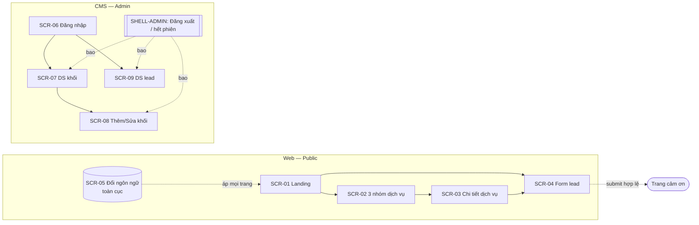

# FSD — Đặc tả chức năng theo màn hình — Landing page dịch vụ B2B Mytel

| Phiên bản | v0.1 | Ngày | 2026-09-02 | Trạng thái | DONE |
|-----------|------|------|------------|------------|------|

> **Ranh giới với SRS:** SRS (`docs/ba/SRS.md`) là nguồn sự thật về **YÊU CẦU** (FR, quy tắc, validate mức dữ liệu, AC). FSD đặc tả **HÀNH VI TRÊN MÀN HÌNH**: element, tương tác, điều hướng, 4 trạng thái UI, ánh xạ errorCode → thông điệp hiển thị. FSD **tham chiếu FR-ID, không chép lại quy tắc**; mâu thuẫn → **SRS thắng** (báo PO sửa SRS trước).
> **Nền đầu vào:** `actor-usecase.md` (UC-01..15, F-01/F-02) · `entity-lifecycle.md` (E-01..04 + ma trận trạng thái×hành động) · `SRS.md` (FR-01..18, NFR-01..10) · HLD (`docs/sa/HLD.md` §7 chuẩn dùng chung + taxonomy mã lỗi).
> **Đã khớp `docs/sa/api-spec.md` v1.0 (DONE 2026-09-02):** 14 endpoint + envelope HLD §7 + bộ mã lỗi canonical (LEAD-/AUTH-/CB-/SYS-). Cột API §4 và phần thông báo lỗi mỗi màn dùng đúng endpoint + mã lỗi của api-spec; tên trường form lead khớp (`contactName/email/phone/companyName/serviceInterest/message/consent/website`).
> **Phụ thuộc chưa sẵn (đánh dấu trong tài liệu):**
> - **`[chờ design.md]`** — bố cục pixel/wireframe/token (Designer chưa truy cập được bản Claude Design "B2B Landing v2" của anh Bryan; cần session của anh). FSD đặc tả **hành vi/cấu trúc/element/trạng thái độc lập bố cục**; bố cục cụ thể bám `design.md` khi có.

## 1. Giới thiệu

- **Mục đích:** đặc tả hành vi từng màn hình của landing page B2B Mytel + Admin CMS-lite đến mức frontend code được, tester bấm theo được.
- **Phạm vi:** đúng 18 FR trong SRS (5 nhóm G1–G5). Nền tảng: **Web** (trang public visitor) + **CMS** (trang Admin sau đăng nhập). Không có App mobile ở MVP (kênh Web — SRS §6).
- **FR được phủ:** FR-01..FR-18 (100%). **Use case được phủ:** UC-01..UC-15 + F-01, F-02. **Đối tượng nghiệp vụ:** E-01 Lead · E-02 Content Block · E-03 Admin Account · E-04 Service.
- **Thuật ngữ:** giữ nguyên tên dịch vụ tiếng Anh + thuật ngữ kỹ thuật (Content Block, Lead, consent, honeypot, rate-limit) theo SRS §1.
- **Quy ước mã lỗi hiển thị:** dùng bộ mã canonical của `api-spec.md §4`/`LLD.md §8`: `LEAD-001/010/020/021/030` · `AUTH-001/010/020/401/403` · `CB-001/010/404` · `SYS-500`. Thông điệp hiển thị (vi) lấy đúng cột message của api-spec. Bảng ánh xạ errorCode→message ở mỗi màn + tổng hợp §4.

## 2. Bản đồ chức năng & màn hình

| Mã màn hình | Tên màn hình | Nền tảng | Chức năng phủ (FR) | Vai trò được truy cập |
|-------------|--------------|:--------:|--------------------|------------------------|
| SCR-01 | Landing tổng (hero + 4 section + khối động + CTA) | Web | FR-01, FR-02, FR-06 | A-01 Khách (ẩn danh), A-03 Sale (như khách) |
| SCR-02 | Danh sách dịch vụ theo 3 nhóm | Web | FR-04, FR-06 | A-01 Khách |
| SCR-03 | Trang chi tiết dịch vụ (template dùng chung 18 dịch vụ) | Web | FR-05, FR-06 | A-01 Khách |
| SCR-04 | Form lead (đăng ký tư vấn) | Web | FR-06, FR-07, FR-08, FR-10 | A-01 Khách |
| SCR-05 | Đổi ngôn ngữ EN ↔ VI (thành phần toàn cục) | Web | FR-03 | A-01 Khách |
| SCR-06 | Admin — Đăng nhập | CMS | FR-16 | A-02 Content Admin |
| SCR-07 | Admin — Danh sách khối nội dung động | CMS | FR-12/13/14 (list), FR-15 (bật/ẩn, sắp thứ tự) | A-02 (đã đăng nhập) |
| SCR-08 | Admin — Thêm/Sửa khối nội dung (3 loại) | CMS | FR-12, FR-13, FR-14, FR-15 | A-02 (đã đăng nhập) |
| SCR-09 | Admin — Danh sách + chi tiết lead (đọc) | CMS | FR-11 | A-02 (đã đăng nhập) |
| (khung) SHELL-ADMIN | Vỏ Admin (thanh điều hướng + Đăng xuất + bảo vệ phiên) | CMS | FR-17 (đăng xuất/hết phiên), FR-18 (audit log — side-effect) | A-02 (đã đăng nhập) |

> **Không có màn riêng — có chủ đích:** **FR-09** (email báo Sale) là **side-effect backend** của SCR-04, không có UI (bám F-01). **FR-18** (audit log) ghi **ngầm** khi có thao tác quản trị ở SCR-06/07/08/09, không có màn hiển thị log ở MVP. **FR-17** là hành vi vỏ Admin (SHELL-ADMIN) áp cho mọi màn CMS, không phải màn độc lập.

### 2b. Phủ Use case (actor) → Màn hình *(bám `actor-usecase.md`)*

| Use case (actor) | Actor | Màn hình phủ (SCR) | Ghi chú |
|------------------|-------|--------------------|---------|
| UC-01 Xem Landing tổng | A-01 | SCR-01 | hero + 4 section + khối động (FR-01/02) |
| UC-02 Duyệt 3 nhóm | A-01 | SCR-02 (và khối "dịch vụ" trên SCR-01) | 18 card / 3 nhóm |
| UC-03 Xem chi tiết dịch vụ | A-01 | SCR-03 | template 18 dịch vụ, hiển thị 7/8 trường |
| UC-04 Đổi ngôn ngữ EN↔VI | A-01 | SCR-05 (toàn cục) | áp mọi trang public |
| UC-05 Điền & submit form lead | A-01 | SCR-04 | validate + consent + chống spam |
| UC-06 Bấm CTA tư vấn | A-01 | SCR-01, SCR-02, SCR-03 → SCR-04 | CTA prefill dịch vụ |
| UC-07 Đăng nhập Admin | A-02 | SCR-06 | khóa 5 lần/15 phút |
| UC-08 Đăng xuất / hết phiên | A-02 | SHELL-ADMIN (mọi màn CMS) | FR-17 |
| UC-09 Quản lý khối Highlight | A-02 | SCR-07 (list) → SCR-08 (form loại Highlight) | FR-12 |
| UC-10 Quản lý khối Đối tác | A-02 | SCR-07 (list) → SCR-08 (form loại Partner) | FR-13 |
| UC-11 Quản lý khối Con số | A-02 | SCR-07 (list) → SCR-08 (form loại Stat) | FR-14 |
| UC-12 Bật/tắt & sắp thứ tự khối | A-02 | SCR-07 | FR-15 |
| UC-13 Xem DS + chi tiết lead | A-02 | SCR-09 | FR-11, Mới→Đã xem |
| UC-14 Sale nhận email lead | A-03 | *(ngoài UI landing)* | email tới hộp thư Sale (FR-09) |
| UC-15 Hệ thống chuyển email lead | A-04 | *(side-effect backend SCR-04)* | FR-09 |
| **F-01** (liên actor: submit → lưu → báo Sale) | A-01→SYS→A-04→A-03; A-02 xem sau | SCR-04 (submit) → *email backend* → SCR-09 (Admin xem) | khâu bàn giao qua email + DB |
| **F-02** (liên actor: Admin cập nhật → khách thấy) | A-02→SYS→A-01 | SCR-08/SCR-07 (đăng thẳng) → SCR-01 (khách thấy) | không luồng duyệt (Q10) |

> Mọi UC + F đều có màn hình; UC-14/UC-15 là nghiệp vụ ngoài UI (email) — có chú thích rõ, không phải use case mồ côi.

---

## 3. Đặc tả từng màn hình

### SCR-01 — Landing tổng *(phủ FR-01, FR-02, FR-06)*

- **Nền tảng:** Web (public) · **Wireframe/bố cục:** `[chờ design.md]` · **Tiền điều kiện vào màn:** không (ẩn danh); URL `/{lang}` (`/en` mặc định, `/vi`).
- **Bảng element:**
  | # | Element | Loại | Hành vi / điều kiện hiển thị·enable | Nguồn dữ liệu / API | Validate hiển thị (ref SRS) | Thông báo trên UI |
  |---|---------|------|--------------------------------------|---------------------|------------------------------|--------------------|
  | 1 | Header + logo + menu ngôn ngữ | nav | Cố định trên cùng; chứa thành phần đổi ngôn ngữ (SCR-05) | — | — | — |
  | 2 | Hero (headline + subheadline + 2 CTA) | section tĩnh | Luôn hiển thị; **CTA chính** → SCR-04, **CTA phụ** → cuộn tới khối dịch vụ (SCR-02) | nội dung i18n (repo) | — | — |
  | 3 | Section "Why Mytel" | section tĩnh | Luôn hiển thị | nội dung i18n (repo) | — | — |
  | 4 | Section "Coverage" | section tĩnh | Luôn hiển thị | nội dung i18n (repo) | — | — |
  | 5 | Section "Capabilities" (3 nhóm dịch vụ) | section tĩnh + grid | Luôn hiển thị; grid 3 nhóm (7/3/8) → mỗi card link SCR-03; bám SCR-02 | nội dung Service (repo) | — | — |
  | 6 | Section "Register" (khối CTA form) | section tĩnh | Luôn hiển thị; nhúng/liên kết SCR-04 | — | — | — |
  | 7 | Khối động **Highlight** (Sản phẩm/dịch vụ mới) | list động | Chỉ hiện khối `Hiển thị` (`status=visible`) đủ bản dịch ngôn ngữ đang xem, sắp `sortOrder` tăng dần (bám **FR-02**); **ẩn cả cụm khi rỗng** | render SSR/ISR (RSC đọc DB, cache TTL ≤60s); hydrate qua `GET /api/public/content-blocks?locale&type=highlight` | FR-02 (bảng quyết định hiển thị) | — |
  | 8 | Khối động **Đối tác** (Partner) | list động | Như #7; logo+tên ngôn ngữ-trung tính → hiện ở cả EN/VI | như #7 | FR-02 | — |
  | 9 | Khối động **Con số nổi bật** (Stat) | list động | Như #7; **không có ô doanh thu** (BR-STAT-01) | như #7 | FR-02 | — |
  | 10 | CTA tư vấn (nhiều điểm) | button | Bám **FR-06**; điều hướng SCR-04, không prefill dịch vụ (landing chung) | — | — | — |
  | 11 | Footer | nav tĩnh | Liên hệ, liên kết, chọn ngôn ngữ | — | — | — |
- **Luồng thao tác trên màn hình (UI flow)** — *bám FR-01, FR-02, FR-06:*
  | # | Người dùng thao tác | Màn hình phản hồi | API gọi (endpoint) | Điều hướng |
  |---|---------------------|-------------------|--------------------|------------|
  | 1 | Mở `/{lang}` | Render hero + 4 section tĩnh + khối động `Hiển thị` đúng ngôn ngữ, đúng thứ tự | SSR/RSC (đọc DB); hydrate `GET /api/public/content-blocks` | — |
  | 2 | Bấm 1 card dịch vụ (#5) | — | — | → SCR-03 (`/{lang}/services/{slug}`) |
  | 3 | Bấm CTA tư vấn (#2/#10) | — | — | → SCR-04 |
  | 4 | Đổi ngôn ngữ (#1) | Toàn trang đổi ngôn ngữ (bám SCR-05/FR-03) | — | → `/{lang'}` cùng trang |
- **Luồng thay thế / ngoại lệ trên UI:**
  - 1a. **Không có khối động nào `Hiển thị`** (hoặc bị ẩn hết ở ngôn ngữ đang xem — BR-DYN-01) → landing **vẫn render đủ hero + 4 section tĩnh**; **3 cụm khối động (#7/#8/#9) thu gọn hoàn toàn** — không hiện tiêu đề mục trống, khung rỗng hay placeholder (bám **FR-01 empty-state**).
  - 1b. Lỗi đọc nguồn khối động (backend lỗi) → **bỏ qua khối lỗi**, phần còn lại (hero + 4 section) vẫn render (bám FR-02 hậu điều kiện thất bại); không chặn cả trang.
- **Trạng thái UI:**
  - **Loading:** SSR/ISR nên trang tới đã có nội dung; khối động nếu tải phía client dùng skeleton nhẹ `[chờ design.md]`.
  - **Empty:** không khối động `Hiển thị` → 3 cụm khối động **biến mất**, chỉ còn hero + 4 section (mục 1a).
  - **Lỗi:** lỗi nguồn khối động → render phần tĩnh, ẩn cụm lỗi (mục 1b); không toast lỗi cho khách.
  - **Thành công:** đủ hero + 4 section + khối động `Hiển thị` đúng thứ tự/ngôn ngữ.
- **Đối tượng nghiệp vụ & trạng thái trên màn hình:** đọc **E-02 Content Block** trạng thái `Hiển thị` (chỉ khối đủ bản dịch); `Nháp`/`Ẩn`/`Đã xóa` **không** render (ma trận E-02: public chỉ ✓ ở `Hiển thị`). Đọc **E-04 Service** trạng thái `Hiển thị`.
- **Phân quyền hiển thị:** công khai, mọi visitor thấy như nhau; không element admin trên trang public.

---

### SCR-02 — Danh sách dịch vụ theo 3 nhóm *(phủ FR-04, FR-06)*

- **Nền tảng:** Web (public) · **Bố cục:** `[chờ design.md]` (grid/card) · **Tiền điều kiện:** không. Có thể là **section trong SCR-01** (#5) và/hoặc trang/anchor riêng `/{lang}#services`.
- **Bảng element:**
  | # | Element | Loại | Hành vi / điều kiện | Nguồn dữ liệu / API | Validate (ref SRS) | Thông báo trên UI |
  |---|---------|------|----------------------|---------------------|---------------------|--------------------|
  | 1 | Tiêu đề nhóm × 3 | heading | 3 nhóm cố định: Connectivity (7) · Mobile ICT (3) · ICT Service (8) | Service (repo) | — | — |
  | 2 | Card dịch vụ × 18 | card/link | Mỗi card = 1 dịch vụ; hiện Tên + Nhóm + mô tả ngắn; bấm → SCR-03 | Service (repo, i18n) | — | — |
  | 3 | CTA trên mỗi card / cuối nhóm | button | Bám **FR-06** → SCR-04 | — | — | — |
- **Luồng thao tác:** *bám FR-04, FR-06:*
  | # | Người dùng thao tác | Màn hình phản hồi | API gọi | Điều hướng |
  |---|---------------------|-------------------|---------|------------|
  | 1 | Xem danh sách | Render đúng 18 card chia 3 nhóm (7/3/8) theo ngôn ngữ đang xem | — (nội dung repo, SSR) | — |
  | 2 | Bấm 1 card | — | — | → SCR-03 `/{lang}/services/{slug}` |
- **Luồng thay thế / ngoại lệ trên UI:** không có empty-state runtime — 18 dịch vụ là nội dung tĩnh trong repo (E-04, luôn `Hiển thị`); nếu thiếu bản dịch một trường → hiển thị bản EN cho trường đó (bám FR-05 1b), không ẩn card.
- **Trạng thái UI:** **Loading:** SSR sẵn nội dung · **Empty:** không áp dụng (catalog cố định) · **Lỗi:** không áp dụng runtime · **Thành công:** 18 card/3 nhóm.
- **Đối tượng & trạng thái:** **E-04 Service** — chỉ `Hiển thị`; không hành động runtime (Tạo/Sửa/Ẩn = ✗ với mọi actor, làm qua repo/deploy).
- **Phân quyền:** công khai.

---

### SCR-03 — Trang chi tiết dịch vụ (template dùng chung 18 dịch vụ) *(phủ FR-05, FR-06)*

- **Nền tảng:** Web (public) · **Bố cục:** `[chờ design.md]` · **Tiền điều kiện:** URL `/{lang}/services/{slug}` hợp lệ (slug ∈ 18 dịch vụ).
- **Map trường hiển thị (8 trường nguồn Excel → hiển thị 7, ẩn 1 — bám FR-05):**
  | # | Trường nguồn (Excel) | Hiển thị? | Element trên màn | Ghi chú |
  |---|----------------------|:---------:|------------------|---------|
  | 1 | Tên (Service name) | ✓ | Tiêu đề trang (H1) | + dùng cho meta title (NFR-07) |
  | 2 | Nhóm (Group) | ✓ | Nhãn nhóm / breadcrumb | Connectivity/Mobile ICT/ICT Service |
  | 3 | What is | ✓ | Đoạn mô tả "Dịch vụ là gì" | — |
  | 4 | Advantage | ✓ | Khối lợi thế/điểm mạnh | — |
  | 5 | Target Customer | ✓ | Khối đối tượng khách hàng | — |
  | 6 | Target Sale | ✓ | Khối mục tiêu/ứng dụng bán | — |
  | 7 | Delivery Timeline | ✓ | Khối thời gian triển khai | — |
  | 8 | **Price Policy** | **✗ (ẩn — Q3)** | *thay bằng* CTA "Đăng ký tư vấn" | không render giá công khai |
- **Bảng element:**
  | # | Element | Loại | Hành vi / điều kiện | Nguồn dữ liệu / API | Validate (ref SRS) | Thông báo trên UI |
  |---|---------|------|----------------------|---------------------|---------------------|--------------------|
  | 1 | 7 khối trường hiển thị (bảng trên) | section | Render theo ngôn ngữ đang xem | Service (repo, i18n) | — | — |
  | 2 | Nút CTA "Đăng ký tư vấn" | button | Bám **FR-06**; điều hướng SCR-04 **prefill "Dịch vụ quan tâm" = dịch vụ này** | — | — | — |
  | 3 | Breadcrumb / link về landing | nav | → SCR-01 / SCR-02 | — | — | — |
- **Luồng thao tác:** *bám FR-05, FR-06:*
  | # | Người dùng thao tác | Màn hình phản hồi | API gọi | Điều hướng |
  |---|---------------------|-------------------|---------|------------|
  | 1 | Mở `/{lang}/services/{slug}` | Render 7 trường + CTA (prefill dịch vụ), không hiện Price Policy | — (nội dung repo, SSR) | — |
  | 2 | Bấm CTA (#2) | — | — | → SCR-04 (ô "Dịch vụ quan tâm" = tên dịch vụ này) |
- **Luồng thay thế / ngoại lệ trên UI:**
  - 1a. `slug` **không thuộc 18 dịch vụ** → **trang 404 song ngữ** (Next.js `notFound()` — nội dung dịch vụ là file repo SSR, không có endpoint DB) + link về landing (bám FR-05 1a); không toast.
  - 1b. Một trường thiếu bản dịch ngôn ngữ đang xem → hiển thị **bản EN** cho trường đó (bám FR-05 1b), không ẩn cả trang.
- **Trạng thái UI:** **Loading:** SSR sẵn nội dung · **Empty:** không áp dụng · **Lỗi:** slug sai → 404 song ngữ · **Thành công:** 7 trường + CTA.
- **Đối tượng & trạng thái:** **E-04 Service** `Hiển thị` (xem chi tiết — ✓ với A-01).
- **Phân quyền:** công khai.

---

### SCR-04 — Form lead (Đăng ký tư vấn) *(phủ FR-06, FR-07, FR-08, FR-10)*

- **Nền tảng:** Web (public) · **Bố cục:** `[chờ design.md]` · **Tiền điều kiện:** không; có thể vào từ CTA landing (không prefill) hoặc CTA trang dịch vụ (prefill "Dịch vụ quan tâm").
- **Bảng element** *(validate chi tiết ở SRS FR-07 — FSD chỉ tả hành vi UI; 6 trường nhập + consent + honeypot):*
  | # | Element | Loại | Hành vi / điều kiện hiển thị·enable | Nguồn / API | Validate (ref SRS) | Thông báo trên UI (khi lỗi) |
  |---|---------|------|--------------------------------------|-------------|--------------------|------------------------------|
  | 1 | Họ tên người liên hệ | input text | Bắt buộc; validate on-blur + on-submit | — | FR-07 bảng validate | "Vui lòng nhập họ tên (2–100 ký tự)" |
  | 2 | Email công việc | input email | Bắt buộc | — | FR-07 | "Email không đúng định dạng" |
  | 3 | Số điện thoại | input tel | Bắt buộc; chỉ chữ số, cho phép `+` đầu | — | FR-07 | "Số điện thoại chỉ gồm 8–15 chữ số" |
  | 4 | Tên doanh nghiệp | input text | Bắt buộc | — | FR-07 | "Vui lòng nhập tên doanh nghiệp (2–150 ký tự)" |
  | 5 | Dịch vụ quan tâm | select (enum) | Bắt buộc; 18 dịch vụ + "Tư vấn chung"; **prefill** khi vào từ SCR-03 | Service (repo) | FR-07 | "Vui lòng chọn dịch vụ quan tâm" |
  | 6 | Lời nhắn / nhu cầu | textarea | Không bắt buộc; ≤ 1000 ký tự (đếm ký tự) | — | FR-07 | "Lời nhắn tối đa 1000 ký tự" |
  | 7 | Ô consent PDPL | checkbox | **Bắt buộc = true**; kèm liên kết nội dung consent (Legal duyệt — AS-07) | — | FR-07 | "Vui lòng đồng ý cho phép xử lý dữ liệu cá nhân trước khi gửi" |
  | 8 | Honeypot | input ẩn | **Ẩn với người thật** (CSS/aria-hidden); phải rỗng; có giá trị → xử lý như bot | — | FR-07 / FR-10 | *(không hiển thị)* |
  | 9 | Nút "Gửi" | button (submit) | Enable mặc định; **disable + spinner** trong lúc gửi (chống double-submit) | `POST /api/leads` | — | — |
  | 10 | (tùy chọn) widget chống bot | script | Turnstile verify server-side (HLD ADR-05/§6); ẩn nếu degrade | — | — | — |
- **Luồng thao tác trên màn hình (UI flow)** — *bám FR-06, FR-07 (luồng chính), FR-08, FR-10:*
  | # | Người dùng thao tác | Màn hình phản hồi | API gọi | Điều hướng |
  |---|---------------------|-------------------|---------|------------|
  | 1 | Nhập các trường + tick consent | Validate client-side theo bảng FR-07; hiện lỗi từng ô on-blur | — | — |
  | 2 | Bấm "Gửi" | Disable nút + spinner; gửi request | `POST /api/leads` (payload + consent + honeypot + token) | — |
  | 3 | (server đạt tất cả) | Ẩn form; hiện **trang cảm ơn** (thành công) | — (envelope success) | → Trang cảm ơn (bám F-01) |
- **Luồng thay thế / ngoại lệ trên UI — ánh xạ errorCode → thông điệp:** *(bám FR-07 luồng thay thế + FR-10)*
  | # | Điều kiện / errorCode (api-spec §3.1) | UI hiển thị | Người dùng làm tiếp |
  |---|----------------------------------------|-------------|----------------------|
  | 2a | Trường bắt buộc trống/sai định dạng → `LEAD-001` (400; kèm `error.details[]` theo từng field) | Lỗi từng ô theo bảng FR-07 (dùng `details[]` gắn đúng ô); **gộp mọi lỗi hiển thị cùng lúc**; giữ giá trị đã nhập; nút Gửi enable lại | Sửa trường, gửi lại |
  | 2b | Consent chưa tick → `LEAD-010` (400) | Thông báo cạnh ô consent: "Vui lòng đồng ý cho phép xử lý dữ liệu cá nhân trước khi gửi" | Tick consent, gửi lại |
  | 2c | Honeypot `website` ≠ rỗng (bot) → cờ spam nội bộ (SRS LEAD-020); **server trả 200 với `data` giả** (api-spec §3.1) | **Trang cảm ơn giả** (không lộ cơ chế); **không tạo lead** | — (kết thúc) |
  | 2d | Vượt rate-limit (>5/IP/60 phút rolling) → `LEAD-021` (429) | Thông báo: "Bạn đã gửi quá số lần cho phép, vui lòng thử lại sau 1 giờ"; nút Gửi disable | Chờ và thử lại sau |
  | 2e | Lỗi lưu DB (rollback) → `LEAD-030` (500) | Toast/inline: "Hệ thống đang bận, vui lòng thử lại"; giữ dữ liệu form; nút Gửi enable lại | Thử lại |
  | 2f | Lưu lead OK nhưng email lỗi | **Không báo lỗi cho khách** — vẫn hiện trang cảm ơn (lead đã lưu `Mới`, email retry ở backend — bám FR-09) | — |
- **Trạng thái UI:**
  - **Loading:** sau bấm Gửi — nút "Gửi" **disable + spinner**, khóa nhập, chống double-submit.
  - **Empty:** không áp dụng (form nhập, không list).
  - **Lỗi:** hiển thị lỗi theo bảng 2a–2e; **giữ nguyên giá trị đã nhập** (không xóa form khi lỗi).
  - **Thành công:** trang cảm ơn ("Cảm ơn, chúng tôi sẽ liên hệ sớm") — bám F-01; không hiển thị lại form.
- **Đối tượng nghiệp vụ & trạng thái trên màn hình:** tạo **E-01 Lead** — trạng thái nguồn `—` → đích `Mới` (ma trận E-01: A-01 chỉ ✓ ở "Tạo"). Không hiển thị/sửa/xóa lead ở màn public.
- **Ràng buộc dữ liệu (PDPL — NFR-04):** không gửi PII qua URL/query; consent bắt buộc trước khi gửi; nội dung consent chờ Legal/DPO (AS-07). Ví dụ dùng dữ liệu ẩn danh.
- **Phân quyền:** công khai; không cần đăng nhập.

---

### SCR-05 — Đổi ngôn ngữ EN ↔ VI (thành phần toàn cục) *(phủ FR-03)*

- **Nền tảng:** Web (public) — **thành phần dùng chung** trên header/footer mọi trang public (SCR-01/02/03/04) · **Bố cục:** `[chờ design.md]` (dropdown/toggle).
- **Bảng element:**
  | # | Element | Loại | Hành vi / điều kiện hiển thị·enable | Nguồn / API | Validate | Thông báo trên UI |
  |---|---------|------|--------------------------------------|-------------|----------|--------------------|
  | 1 | Nút/menu chọn EN | toggle/link | Đổi tiền tố URL `/en`; đánh dấu ngôn ngữ đang chọn | — | — | — |
  | 2 | Nút/menu chọn VI | toggle/link | Đổi tiền tố URL `/vi` | — | — | — |
  | 3 | Mục MY | *ẩn* | **Không render** trên UI ở MVP (khung `/my` sẵn nhưng chưa bật — BR-11) | — | — | — |
- **Luồng thao tác:** *bám FR-03:*
  | # | Người dùng thao tác | Màn hình phản hồi | API gọi | Điều hướng |
  |---|---------------------|-------------------|---------|------------|
  | 1 | Bấm chọn EN hoặc VI | Đổi tiền tố URL, tải nội dung ngôn ngữ đó, **giữ nguyên trang hiện tại** | — (SSR theo locale) | → cùng trang với `/{lang'}` |
  | 2 | (đang ở trang chi tiết dịch vụ) đổi ngôn ngữ | Giữ nguyên trang dịch vụ, đổi nội dung sang ngôn ngữ mới | — | → `/{lang'}/services/{slug}` |
  | 3 | (đang điền form SCR-04) đổi ngôn ngữ | **Giữ nguyên dữ liệu đã nhập**; chỉ nhãn/thông báo đổi ngôn ngữ | — | → cùng trang form |
- **Luồng thay thế / ngoại lệ trên UI:**
  - 1a. Khối động thiếu bản dịch ngôn ngữ đang chọn → **ẩn khối đó ở ngôn ngữ thiếu** (BR-DYN-01); khối đủ dịch vẫn hiển thị (bám FR-03 1a / FR-02). *(Không có mã lỗi/thông điệp cho khách — server lọc im lặng: `GET /api/public/content-blocks` chỉ trả khối đủ trường bắt buộc của locale, giống logic SSR — api-spec §3.2.)*
  - 1b. Chọn MY → không có lựa chọn trên UI (mục MY ẩn — BR-11).
- **Trạng thái UI:** **Loading:** chuyển trang SSR nhanh; **Empty:** n/a; **Lỗi:** nếu locale route lỗi → giữ ngôn ngữ hiện tại (FR-03 hậu điều kiện thất bại); **Thành công:** toàn trang đổi ngôn ngữ, layout không vỡ (NFR-05).
- **Đối tượng & trạng thái:** đọc **E-02 Content Block** + **E-04 Service** theo `locale`; không đổi trạng thái đối tượng.
- **Phân quyền:** công khai.

---

### SHELL-ADMIN — Vỏ Admin (điều hướng + Đăng xuất + bảo vệ phiên) *(phủ FR-17; ghi audit FR-18)*

- **Nền tảng:** CMS · **Bố cục:** `[chờ design.md]` · **Tiền điều kiện:** đã đăng nhập (phiên hợp lệ). Bao mọi màn CMS (SCR-07/08/09).
- **Bảng element:**
  | # | Element | Loại | Hành vi / điều kiện | Nguồn / API | Validate | Thông báo trên UI |
  |---|---------|------|----------------------|-------------|----------|--------------------|
  | 1 | Thanh điều hướng (Khối nội dung / Lead) | nav | Chuyển giữa SCR-07 và SCR-09 | — | — | — |
  | 2 | Tên/emai admin đăng nhập | label | Hiển thị email tài khoản (E-03) | phiên hiện tại | — | — |
  | 3 | Nút "Đăng xuất" | button | Bám **FR-17**; hủy phiên → về SCR-06 | `POST /api/auth/signout` (Auth.js signOut) | — | — |
- **Luồng thao tác:** *bám FR-17:*
  | # | Người dùng thao tác | Màn hình phản hồi | API gọi | Điều hướng |
  |---|---------------------|-------------------|---------|------------|
  | 1 | Bấm "Đăng xuất" | Hủy phiên; ghi audit log | `POST /api/auth/signout` | → SCR-06 |
  | 2 | Không thao tác 30 phút, rồi thao tác bất kỳ | Phiên hết hạn → chặn, chuyển đăng nhập | — (middleware) | → SCR-06 |
- **Luồng thay thế / ngoại lệ trên UI:**
  - 2a. Phiên hết hạn (30 phút) hoặc chưa đăng nhập → `AUTH-020` (401) / `AUTH-401` (middleware) → **chuyển SCR-06** (302 về đăng nhập, NFR-03); sau đăng nhập lại có thể quay về trang đích.
- **Trạng thái UI:** Loading/Empty/Lỗi/Thành công theo màn con; vỏ chỉ có trạng thái "phiên hợp lệ / hết phiên".
- **Đối tượng & trạng thái:** **E-03 Admin Account** — đăng xuất kết thúc phiên (không đổi trạng thái tài khoản). **FR-18:** mọi thao tác trong vỏ (đăng xuất) + màn con ghi 1 dòng `audit_log` (side-effect, không màn hiển thị ở MVP).
- **Phân quyền:** chỉ A-02 (đã xác thực); visitor không truy cập được (`/admin/*` chặn bởi middleware).

---

### SCR-06 — Admin Đăng nhập *(phủ FR-16)*

- **Nền tảng:** CMS · **Bố cục:** `[chờ design.md]` · **Tiền điều kiện:** chưa đăng nhập; nếu đã có phiên → chuyển thẳng SCR-07.
- **Bảng element:**
  | # | Element | Loại | Hành vi / điều kiện hiển thị·enable | Nguồn / API | Validate (ref SRS) | Thông báo trên UI (khi lỗi) |
  |---|---------|------|--------------------------------------|-------------|--------------------|------------------------------|
  | 1 | Email | input email | Bắt buộc | — | FR-16 | *(dùng thông báo chung khi sai — mục 1a)* |
  | 2 | Mật khẩu | input password | Bắt buộc; ẩn ký tự; toggle hiện/ẩn | — | FR-16 (NFR-03 ≥12 ký tự khi đổi MK) | — |
  | 3 | Nút "Đăng nhập" | button (submit) | **Disable + spinner** khi đang gửi (chống double-submit) | `POST /api/auth/callback/credentials` (Auth.js Credentials) | — | — |
  | 4 | Vùng thông báo lỗi chung | alert | Hiện lỗi **không tiết lộ trường nào sai** | — | — | "Email hoặc mật khẩu không đúng" |
- **Luồng thao tác:** *bám FR-16:*
  | # | Người dùng thao tác | Màn hình phản hồi | API gọi | Điều hướng |
  |---|---------------------|-------------------|---------|------------|
  | 1 | Nhập email + mật khẩu, bấm Đăng nhập | Disable nút + spinner; gửi xác thực | `POST /api/auth/callback/credentials` | — |
  | 2 | (đúng, tài khoản `Hoạt động`) | Tạo phiên 30 phút; vào trang quản trị | — (set cookie) | → SCR-07 |
- **Luồng thay thế / ngoại lệ trên UI — ánh xạ errorCode → thông điệp:** *(bám FR-16 luồng thay thế + bảng quyết định)*
  | # | Điều kiện / errorCode (api-spec §3.3) | UI hiển thị | Người dùng làm tiếp |
  |---|----------------------------------------|-------------|----------------------|
  | 1a | Sai email **hoặc** mật khẩu → `AUTH-001` (401) | Thông báo **chung**: "Email hoặc mật khẩu không đúng" (không nói trường nào sai); nút enable lại | Nhập lại |
  | 1b | Đạt 5 lần sai/15 phút → tài khoản `Tạm khóa` 15 phút → `AUTH-010` (423) | "Tài khoản tạm khóa, thử lại sau 15 phút" | Chờ hết khóa |
  | 1c | Đăng nhập khi đang `Tạm khóa` → `AUTH-010` | "Tài khoản tạm khóa, thử lại sau <thời gian còn lại>" | Chờ hết khóa |
- **Trạng thái UI:** **Loading:** nút disable + spinner khi xác thực · **Empty:** n/a · **Lỗi:** thông báo 1a–1c (không tiết lộ trường sai) · **Thành công:** điều hướng SCR-07 (không toast bắt buộc).
- **Đối tượng nghiệp vụ & trạng thái trên màn hình:** **E-03 Admin Account** — `Hoạt động` → (đăng nhập đúng) tạo phiên & reset đếm sai; `Hoạt động` → `Tạm khóa` khi đủ 5 sai/15 phút; khi `Tạm khóa`: nút Đăng nhập vẫn hiện nhưng server **từ chối** (báo thời gian mở khóa) — bám ma trận E-03 (Đăng nhập ✓ ở `Hoạt động`, ✗ ở `Tạm khóa`).
- **Phân quyền:** không có màn "đăng ký admin" trên UI (chống tạo tài khoản trái phép — E-03); tài khoản seed từ AS-14.

---

### SCR-07 — Admin Danh sách khối nội dung động *(phủ FR-12/13/14 list, FR-15 bật/ẩn & sắp thứ tự)*

- **Nền tảng:** CMS (trong SHELL-ADMIN) · **Bố cục:** `[chờ design.md]` · **Tiền điều kiện:** đã đăng nhập.
- **Bảng element:**
  | # | Element | Loại | Hành vi / điều kiện hiển thị·enable | Nguồn / API | Validate (ref SRS) | Thông báo trên UI |
  |---|---------|------|--------------------------------------|-------------|--------------------|--------------------|
  | 1 | Bộ lọc theo loại | select | Lọc Highlight / Đối tác / Con số / Tất cả | `GET /api/admin/content-blocks` | — | — |
  | 2 | Bộ lọc theo trạng thái | select | Nháp / Hiển thị / Ẩn / Tất cả (loại `Đã xóa` khỏi DS mặc định) | như #1 | — | — |
  | 3 | Bảng danh sách khối | table | Cột: loại, tiêu đề/tên, trạng thái (badge), thứ tự, cập nhật; sắp theo thứ tự hiển thị | `GET /api/admin/content-blocks` | — | — |
  | 4 | Nút "Tạo khối" (theo loại) | button | → SCR-08 (chế độ tạo, chọn loại) | — | — | — |
  | 5 | Nút "Sửa" (mỗi hàng) | button | Hiện khi trạng thái ∈ {`Nháp`,`Hiển thị`,`Ẩn`}; **ẩn** với `Đã xóa` | — | — | — |
  | 6 | Nút "Bật hiển thị" (mỗi hàng) | button | **Hiện & enable** khi trạng thái ∈ {`Nháp`,`Ẩn`}; **ẩn** khi `Hiển thị`/`Đã xóa` (bám FR-15) | `PATCH /api/admin/content-blocks/{id}/visibility` | FR-15 (đủ trường EN) | *(khi thiếu trường EN)* xem 6a |
  | 7 | Nút "Tắt hiển thị" (mỗi hàng) | button | **Hiện & enable** khi trạng thái = `Hiển thị`; **ẩn** ở trạng thái khác (bám FR-15) | `PATCH /api/admin/content-blocks/{id}/visibility` | — | — |
  | 8 | Điều khiển "Sắp thứ tự" | input số / kéo-thả | Đổi số thứ tự (nguyên ≥ 0); áp cho `Nháp`/`Hiển thị`/`Ẩn`; trùng số → sắp phụ theo thời điểm cập nhật giảm dần | `PATCH /api/admin/content-blocks/reorder` | FR-15 | "Thứ tự là số nguyên ≥ 0" |
  | 9 | Nút "Xóa" (mỗi hàng) | button | Mở hộp xác nhận; soft-delete → `Đã xóa`; ẩn với `Đã xóa` | `DELETE /api/admin/content-blocks/{id}` | — | — |
  | 10 | Badge trạng thái | label | Màu theo `Nháp`/`Hiển thị`/`Ẩn` `[chờ design.md]` | — | — | — |
- **Luồng thao tác:** *bám FR-12/13/14 (list), FR-15:*
  | # | Người dùng thao tác | Màn hình phản hồi | API gọi | Điều hướng |
  |---|---------------------|-------------------|---------|------------|
  | 1 | Mở mục "Khối nội dung" | Hiển thị danh sách khối (lọc theo loại/trạng thái) | `GET /api/admin/content-blocks` | — |
  | 2 | Bấm "Tạo khối" (#4) | — | — | → SCR-08 (tạo) |
  | 3 | Bấm "Sửa" (#5) | — | — | → SCR-08 (sửa) |
  | 4 | Bấm "Bật hiển thị" (#6) | Đổi trạng thái → `Hiển thị`; badge đổi; public thấy ≤ TTL cache; toast | `PATCH .../{id}/visibility` | — |
  | 5 | Bấm "Tắt hiển thị" (#7) | Đổi trạng thái → `Ẩn`; badge đổi; public ẩn ≤ TTL; toast | `PATCH .../{id}/visibility` | — |
  | 6 | Đổi thứ tự (#8) | Cập nhật thứ tự; danh sách + public phản ánh; toast | `PATCH .../reorder` | — |
  | 7 | Bấm "Xóa" (#9) → xác nhận | Soft-delete → `Đã xóa`; ẩn khỏi DS + public; toast | `DELETE /api/admin/content-blocks/{id}` | — |
- **Luồng thay thế / ngoại lệ trên UI — ánh xạ errorCode → thông điệp:**
  | # | Điều kiện / errorCode (api-spec §3.9) | UI hiển thị | Người dùng làm tiếp |
  |---|----------------------------------------|-------------|----------------------|
  | 6a | Bật hiển thị khi **thiếu trường bắt buộc EN** → `CB-010` (422) | Chặn; báo "Cần đủ trường tiếng Anh bắt buộc trước khi hiển thị"; trạng thái giữ nguyên | Vào SCR-08 bổ sung EN |
  | 6b | Khối không tồn tại/đã xóa → `CB-404` (404) | "Không tìm thấy nội dung"; làm mới danh sách | Về DS |
  | Xa | Phiên hết hạn → `AUTH-020` (401) | Chuyển SCR-06 (bám SHELL-ADMIN 2a) | Đăng nhập lại |
- **Trạng thái UI:**
  - **Loading:** skeleton bảng `[chờ design.md]` trong lúc GET danh sách.
  - **Empty:** chưa có khối nào → thông báo "Chưa có khối nội dung nào" + nút "Tạo khối"; **không hiện bảng rỗng**.
  - **Lỗi:** GET/PATCH lỗi → thông báo "Không tải/lưu được, thử lại" + nút "Thử lại".
  - **Thành công:** danh sách khối; sau thao tác bật/ẩn/thứ tự/xóa → toast xác nhận + cập nhật hàng.
- **Đối tượng nghiệp vụ & trạng thái trên màn hình** *(bám ma trận E-02):*
  | Trạng thái khối | Xem (admin) | Sửa (#5) | Bật hiển thị (#6) | Tắt hiển thị (#7) | Sắp thứ tự (#8) | Xóa (#9) |
  |-----------------|:-----------:|:--------:|:-----------------:|:-----------------:|:---------------:|:--------:|
  | `Nháp` | ✓ | ✓ | ✓ | ✗ (ẩn) | ✓ | ✓ |
  | `Hiển thị` | ✓ | ✓ | ✗ (ẩn) | ✓ | ✓ | ✓ |
  | `Ẩn` | ✓ | ✓ | ✓ | ✗ (ẩn) | ✓ | ✓ |
  | `Đã xóa` | ✗ (ẩn khỏi DS) | ✗ | ✗ | ✗ | ✗ | ✗ |
- **Phân quyền:** chỉ A-02 (đã xác thực). Ghi `audit_log` mọi thao tác (FR-18).

---

### SCR-08 — Admin Thêm/Sửa khối nội dung (3 loại, đa ngữ, ẩn/hiện, sắp thứ tự) *(phủ FR-12, FR-13, FR-14, FR-15)*

- **Nền tảng:** CMS (trong SHELL-ADMIN) · **Bố cục:** `[chờ design.md]` · **Tiền điều kiện:** đã đăng nhập; chế độ **Tạo** (từ SCR-07 #4, chọn loại) hoặc **Sửa** (từ SCR-07 #5, load khối theo id).
- **Bảng element — khung chung + trường theo loại** *(validate chi tiết ở SRS FR-12/13/14; FSD tả hành vi UI):*
  | # | Element | Loại | Áp dụng loại | Hành vi / điều kiện | Validate (ref SRS) | Thông báo trên UI (khi lỗi) |
  |---|---------|------|--------------|----------------------|--------------------|------------------------------|
  | 0 | Chọn loại khối | select (chỉ khi Tạo) | tất cả | Highlight / Đối tác / Con số; khóa khi Sửa | — | — |
  | 1 | Tab/nhóm **EN** và **VI** | tab đa ngữ | tất cả | Nhập song ngữ; EN bắt buộc, VI khuyến nghị (thiếu VI → ẩn ở VI, BR-DYN-01) | — | — |
  | 2 | Tiêu đề EN / VI | input | Highlight | EN bắt buộc (2–120); VI ≤120 | FR-12 | "Tiêu đề EN bắt buộc (2–120 ký tự)" |
  | 3 | Mô tả ngắn EN / VI | textarea | Highlight | EN bắt buộc (2–300); VI ≤300 | FR-12 | "Mô tả EN bắt buộc (2–300 ký tự)" |
  | 4 | Ảnh | upload | Highlight | jpg/png/webp ≤ 2 MB; xem trước | FR-12 | "Ảnh định dạng jpg/png/webp, tối đa 2 MB" |
  | 5 | Tên đối tác | input | Đối tác | Bắt buộc (2–120); ngôn ngữ-trung tính | FR-13 | "Tên đối tác bắt buộc (2–120 ký tự)" |
  | 6 | Logo | upload | Đối tác | **Bắt buộc**; jpg/png/svg/webp ≤ 1 MB | FR-13 | "Logo bắt buộc, định dạng jpg/png/svg/webp, tối đa 1 MB" |
  | 7 | Nhãn EN / VI | input | Con số | EN bắt buộc (2–80); VI ≤80 | FR-14 | "Nhãn EN bắt buộc (2–80 ký tự)" |
  | 8 | Giá trị | input | Con số | Bắt buộc; regex `^(?=.*[0-9])[0-9.,]{1,19}[+%]?$`; **không có ô doanh thu** (BR-STAT-01) | FR-14 | "Giá trị chỉ gồm chữ số và dấu ngăn cách, hậu tố + hoặc % (vd: 1.200+, 63, 99%); tối đa 20 ký tự" |
  | 9 | Đơn vị EN / VI | input | Con số | ≤30 mỗi ngôn ngữ; phần chữ (tỉnh/khách hàng) nhập ở đây, không nhập vào Giá trị | FR-14 | "Đơn vị EN/VI tối đa 30 ký tự" |
  | 10 | Link | input url | Highlight / Đối tác | Không bắt buộc; `^https?://` ≤500 | FR-12/13 | "Link phải bắt đầu bằng http:// hoặc https://" |
  | 11 | Thứ tự | input số | tất cả | Bắt buộc; nguyên ≥ 0; mặc định cuối danh sách | FR-12/13/14 | "Thứ tự là số nguyên ≥ 0" |
  | 12 | Nút "Lưu nháp" | button | tất cả | Lưu khối trạng thái `Nháp` (tạo) hoặc cập nhật (sửa) | — | — |
  | 13 | Nút "Lưu & Bật hiển thị" | button | tất cả | Lưu + chuyển `Hiển thị`; **chặn nếu thiếu trường EN** (CB-010) | — | *(xem 12b)* |
  | 14 | Nút "Hủy" | button | tất cả | Bỏ thay đổi → về SCR-07 | — | — |
- **Luồng thao tác:** *bám FR-12/13/14 (CRUD), FR-15 (bật hiển thị):*
  | # | Người dùng thao tác | Màn hình phản hồi | API gọi | Điều hướng |
  |---|---------------------|-------------------|---------|------------|
  | 1 | (Tạo) chọn loại + nhập trường | Hiện đúng bộ trường theo loại; validate on-blur | — | — |
  | 2 | Bấm "Lưu nháp" (#12) | Validate; lưu khối `Nháp`; toast; (tạo) gán id | (tạo) `POST /api/admin/content-blocks` · (sửa) `PATCH /api/admin/content-blocks/{id}` | → SCR-07 (hoặc ở lại) |
  | 3 | Bấm "Lưu & Bật hiển thị" (#13) | Validate (đủ EN); lưu + chuyển `Hiển thị`; toast | `POST`/`PATCH .../{id}` + `PATCH .../{id}/visibility` (action=show) | → SCR-07 |
  | 4 | (Sửa) sửa trường + Lưu | Validate; cập nhật; nếu khối `Hiển thị` → public cập nhật ≤ TTL | `PATCH /api/admin/content-blocks/{id}` | → SCR-07 |
- **Luồng thay thế / ngoại lệ trên UI — ánh xạ errorCode → thông điệp:**
  | # | Điều kiện / errorCode (api-spec §3.6/3.8/3.9) | UI hiển thị | Người dùng làm tiếp |
  |---|-----------------------------------------------|-------------|----------------------|
  | 12a | Trường bắt buộc trống/sai → `CB-001` (400; kèm `error.details[]` theo field) | Lỗi từng ô theo bảng FR-12/13/14; giữ dữ liệu | Sửa, lưu lại |
  | 12b | "Lưu & Bật hiển thị" khi thiếu trường EN → `CB-010` (422) | Chặn bật; báo "Cần đủ trường tiếng Anh bắt buộc trước khi hiển thị"; đã lưu ở `Nháp` nếu hợp lệ phần còn lại | Bổ sung EN, bật lại |
  | 12c | Sửa khối `Đã xóa` | Không cho vào form (nút Sửa ẩn ở SCR-07); nếu vào trực tiếp → báo "Khối đã xóa, không thể sửa" | Quay lại DS |
- **Trạng thái UI:**
  - **Loading:** (Sửa) skeleton form khi load khối theo id; nút Lưu disable + spinner khi đang lưu.
  - **Empty:** (Tạo) form trống với giá trị mặc định (thứ tự = cuối danh sách).
  - **Lỗi:** lỗi validate → lỗi từng ô (12a/12b); lỗi mạng/lưu → toast "Không lưu được, thử lại".
  - **Thành công:** toast "Đã lưu" / "Đã bật hiển thị"; điều hướng SCR-07.
- **Đối tượng nghiệp vụ & trạng thái trên màn hình** *(bám E-02):* tạo khối → `Nháp`; "Lưu & Bật hiển thị" → `Hiển thị` (điều kiện đủ EN); sửa không đổi trạng thái (áp `Nháp`/`Hiển thị`/`Ẩn`, không sửa `Đã xóa`). 3 loại (Highlight/Đối tác/Con số) chung 1 vòng đời.
- **Phân quyền:** chỉ A-02 (đã xác thực); ghi `audit_log` (FR-18).

---

### SCR-09 — Admin Danh sách + chi tiết lead (đọc) *(phủ FR-11)*

- **Nền tảng:** CMS (trong SHELL-ADMIN) · **Bố cục:** `[chờ design.md]` · **Tiền điều kiện:** đã đăng nhập.
- **Bảng element:**
  | # | Element | Loại | Hành vi / điều kiện hiển thị·enable | Nguồn / API | Validate | Thông báo trên UI |
  |---|---------|------|--------------------------------------|-------------|----------|--------------------|
  | 1 | Bộ lọc trạng thái (Mới/Đã xem/Tất cả) | select | Lọc theo trạng thái lead | `GET /api/admin/leads` | — | — |
  | 2 | Bộ lọc theo ngày | date range | Lọc theo thời điểm gửi | như #1 | — | — |
  | 3 | Bộ lọc theo dịch vụ | select | 18 dịch vụ + "Tư vấn chung" | như #1 | — | — |
  | 4 | Bảng danh sách lead | table | Cột: thời điểm gửi, họ tên, doanh nghiệp, dịch vụ, trạng thái (badge Mới/Đã xem), trạng thái email; sắp theo thời điểm gửi **giảm dần**; **phân trang 20/trang** | `GET /api/admin/leads` | — | — |
  | 5 | Hàng lead (bấm mở) | row/link | Mở chi tiết; lead `Mới` → đánh dấu `Đã xem` | `GET /api/admin/leads/{id}` | — | — |
  | 6 | Panel/trang chi tiết lead | detail | Hiện đủ trường lead (họ tên, email, SĐT, DN, dịch vụ, lời nhắn, thời điểm, ngôn ngữ lúc gửi, consent) | `GET /api/admin/leads/{id}` | — | — |
  | 7 | Nút Sửa / Xóa lead | *ẩn* | **Không hiển thị** ở MVP (BR-18 chỉ đọc) | — | — | — |
  | 8 | Nút "Xóa lọc" | button | Hiện khi có bộ lọc áp dụng và kết quả rỗng | — | — | — |
- **Luồng thao tác:** *bám FR-11:*
  | # | Người dùng thao tác | Màn hình phản hồi | API gọi | Điều hướng |
  |---|---------------------|-------------------|---------|------------|
  | 1 | Mở mục "Lead" | Hiển thị danh sách (sắp giảm dần, phân trang 20/trang) | `GET /api/admin/leads` | — |
  | 2 | Áp bộ lọc (#1/2/3) | Lọc danh sách | `GET /api/admin/leads` (query `status`/`serviceInterest`/`dateFrom`/`dateTo`/`page`) | — |
  | 3 | Mở 1 lead (#5) | Hiển thị chi tiết; nếu `Mới` → đánh dấu `Đã xem` (badge đổi); ghi audit log | `GET /api/admin/leads/{id}` (đánh dấu `viewed` trong cùng lời gọi — api-spec §3.13) | — |
- **Luồng thay thế / ngoại lệ trên UI:**
  | # | Điều kiện / errorCode | UI hiển thị | Người dùng làm tiếp |
  |---|-----------------------|-------------|----------------------|
  | 1a | Chưa đăng nhập / phiên hết hạn → `AUTH-020` (401) / `AUTH-401` | Chuyển SCR-06 (bám SHELL-ADMIN) | Đăng nhập lại |
  | 1b | **Chưa có lead nào** (DB rỗng) | **Empty-state:** "Chưa có lead nào" + gợi ý "Lead từ form sẽ hiện ở đây"; **không bảng rỗng, không phân trang, không nút thao tác hàng** (bám FR-11 1b) | — |
  | 1c | Bộ lọc không khớp | "Không có lead khớp bộ lọc" + nút "Xóa lọc" (#8) (bám FR-11 1c) | Xóa/đổi lọc |
  | 3a | Không quyền sửa/xóa (MVP) | Không hiện nút Sửa/Xóa (BR-18) | — |
- **Trạng thái UI:**
  - **Loading:** skeleton bảng khi GET danh sách.
  - **Empty:** DB rỗng → empty-state (1b); lọc rỗng → "Không có lead khớp bộ lọc" (1c).
  - **Lỗi:** GET lỗi → "Không tải được danh sách lead, thử lại" + nút "Thử lại".
  - **Thành công:** danh sách lead; mở chi tiết → hiện panel + badge chuyển `Đã xem`.
- **Đối tượng nghiệp vụ & trạng thái trên màn hình** *(bám ma trận E-01):*
  | Trạng thái lead | Xem (DS + chi tiết) | Sửa trường | Xóa | Đánh dấu Đã xem |
  |-----------------|:-------------------:|:----------:|:---:|:---------------:|
  | `Mới` | ✓ | ✗ (ẩn — BR-18) | ✗ (ẩn — ngoài phạm vi) | ✓ (tự động khi mở lần đầu) |
  | `Đã xem` | ✓ | ✗ (ẩn) | ✗ (ẩn) | — (đã đánh dấu) |
  - PII lead (họ tên/email/SĐT/DN) hiển thị cho admin đã xác thực; không đưa PII vào URL/log (NFR-04).
- **Phân quyền:** chỉ A-02 (đã xác thực); ghi `audit_log` khi mở lead (FR-18).

---

## 4. Ma trận ánh xạ FR ↔ Use case ↔ Màn hình ↔ API ↔ Trạng thái

> Endpoint khớp `docs/sa/api-spec.md v1.0` (14 endpoint). Phủ **18/18 FR**.

| FR (SRS) | Use case (actor) | Màn hình (SCR) | Nền tảng | API (api-spec v1.0) | Đối tượng · trạng thái nguồn→đích | Ghi chú |
|----------|------------------|----------------|:--------:|----------------------|-----------------------------------|---------|
| FR-01 | UC-01 (A-01) | SCR-01 | Web | SSR/RSC render landing (đọc DB) | Content Block/Service (đọc `Hiển thị`) | empty-state khi khối động ẩn hết |
| FR-02 | UC-01 (A-01) | SCR-01 | Web | SSR + `GET /api/public/content-blocks` | Content Block (đọc `Hiển thị` theo locale) | ẩn khối thiếu bản dịch (BR-DYN-01) |
| FR-03 | UC-04 (A-01) | SCR-05 (+ mọi trang public) | Web | route theo `[locale]` (SSR, next-intl) | Content Block/Service (đọc theo ngôn ngữ) | MY ẩn; giữ dữ liệu form khi đổi |
| FR-04 | UC-02 (A-01) | SCR-02 (+ khối #5 SCR-01) | Web | catalog repo (SSR) — không endpoint DB | Service (đọc `Hiển thị`) | 18 card / 3 nhóm (7/3/8) |
| FR-05 | UC-03 (A-01) | SCR-03 | Web | service detail repo (SSR) — không endpoint DB | Service (đọc `Hiển thị`) | 7/8 trường; ẩn Price Policy; 404 (`notFound()`) nếu slug sai |
| FR-06 | UC-06 (A-01) | SCR-01, SCR-02, SCR-03 → SCR-04 | Web | — (điều hướng client) | Service, Lead (không đổi) | CTA prefill dịch vụ từ SCR-03 |
| FR-07 | UC-05 (A-01) | SCR-04 | Web | `POST /api/leads` | Lead: — → `Mới` | validate ref FR-07; LEAD-001/010/021/030 (honeypot 200 giả) |
| FR-08 | UC-05 (A-01) | SCR-04 (bước 3) | Web | `POST /api/leads` (cùng #7) | Lead: — → `Mới` (nguyên tử) | bám FR-07 bước 3 |
| FR-09 | UC-14, UC-15 (A-03/A-04) | *(không màn — backend, side-effect SCR-04)* | — | backend SMTP (Nodemailer) | Lead `Mới` (gửi email báo Sale) | F-01; email lỗi không mất lead (`emailStatus=failed`) |
| FR-10 | UC-05 (A-01) | SCR-04 (honeypot #8) | Web | `POST /api/leads` (chống spam server-side) | Lead (chặn sinh `Mới` khi spam) | honeypot `website` rỗng + rate-limit 5/IP/60ph; LEAD-021 |
| FR-11 | UC-13 (A-02) | SCR-09 | CMS | `GET /api/admin/leads` · `GET /api/admin/leads/{id}` | Lead: `Mới` → `Đã xem` | detail đánh dấu `viewed` cùng lời gọi; empty-state rỗng/lọc rỗng; chỉ đọc (BR-18) |
| FR-12 | UC-09 (A-02) | SCR-07 (list) → SCR-08 (Highlight) | CMS | `GET`/`POST`/`GET {id}`/`PATCH {id}`/`DELETE {id}` `/api/admin/content-blocks` | Content Block: — → `Nháp`; sửa/xóa | đa ngữ; ẩn ở VI khi thiếu (BR-DYN-01); CB-001/404 |
| FR-13 | UC-10 (A-02) | SCR-07 → SCR-08 (Đối tác) | CMS | như FR-12 (`blockType=partner`) | Content Block: — → `Nháp`; sửa/xóa | logo bắt buộc; ngôn ngữ-trung tính |
| FR-14 | UC-11 (A-02) | SCR-07 → SCR-08 (Con số) | CMS | như FR-12 (`blockType=stat`) | Content Block: — → `Nháp`; sửa/xóa | không ô doanh thu (BR-STAT-01); `payload.value` regex |
| FR-15 | UC-12 (A-02) | SCR-07 | CMS | `PATCH .../{id}/visibility` · `PATCH .../reorder` | Content Block: `Nháp`/`Ẩn` → `Hiển thị`; `Hiển thị` → `Ẩn` | chặn bật khi thiếu EN (CB-010); revalidateTag |
| FR-16 | UC-07 (A-02) | SCR-06 | CMS | `POST /api/auth/callback/credentials` (Auth.js) | Admin Account: `Hoạt động` ↔ `Tạm khóa` | khóa 5 sai/15ph; AUTH-001 (401)/010 (423); báo lỗi chung |
| FR-17 | UC-08 (A-02) | SHELL-ADMIN (mọi màn CMS) | CMS | `POST /api/auth/signout` · `GET /api/auth/session` · middleware | Admin Account (kết thúc phiên) | hết phiên 30 phút → SCR-06 (AUTH-020/401) |
| FR-18 | UC-07..13 (A-02) | *(side-effect SCR-06/07/08/09)* | CMS | backend ghi `audit_log` (mọi mutation admin) | Admin Account/Content Block/Lead (ghi log mọi thao tác) | không màn hiển thị log ở MVP |

### 4b. Phủ trạng thái vòng đời → Màn hình *(bám ma trận trạng thái×hành động của `entity-lifecycle.md`)*

**E-01 Lead**
| Trạng thái \ Hành động | Xem | Sửa trường | Xóa | Đánh dấu Đã xem |
|------------------------|:---:|:----------:|:---:|:---------------:|
| `Mới` | SCR-09 | ✗ (ẩn — BR-18) | ✗ (ngoài phạm vi) | SCR-09 (tự động khi mở) |
| `Đã xem` | SCR-09 | ✗ (ẩn) | ✗ | — (đã đánh dấu) |
> Tạo Lead (— → `Mới`) ở **SCR-04** (A-01). Mọi ô ✓ có màn; mọi ô ✗ đã ẩn/disable trên SCR-09.

**E-02 Content Block**
| Trạng thái \ Hành động | Xem (admin) | Xem (public) | Sửa | Bật hiển thị | Tắt hiển thị | Sắp thứ tự | Xóa |
|------------------------|:-----------:|:------------:|:---:|:------------:|:------------:|:----------:|:---:|
| `Nháp` | SCR-07 | ✗ | SCR-08 | SCR-07/08 | ✗ (ẩn) | SCR-07 | SCR-07 |
| `Hiển thị` | SCR-07 | SCR-01 | SCR-08 | ✗ (ẩn) | SCR-07 | SCR-07 | SCR-07 |
| `Ẩn` | SCR-07 | ✗ | SCR-08 | SCR-07 | ✗ (ẩn) | SCR-07 | SCR-07 |
| `Đã xóa` | ✗ (ẩn DS) | ✗ | ✗ | ✗ | ✗ | ✗ | ✗ |
> Tạo (— → `Nháp`) ở **SCR-08**. Mọi ô ✓ có màn; ô ✗ ẩn/disable đúng theo trạng thái ở SCR-07.

**E-03 Admin Account**
| Trạng thái \ Hành động | Đăng nhập | Đổi mật khẩu | Truy cập trang quản trị | Bị khóa tự động |
|------------------------|:---------:|:------------:|:------------------------:|:---------------:|
| `Hoạt động` | SCR-06 | *(ngoài MVP — không có FR/endpoint)* | SHELL-ADMIN (khi có phiên) | SCR-06 (đủ 5 sai/15ph, server) |
| `Tạm khóa` | ✗ (server từ chối, báo thời gian mở khóa) | ✗ | ✗ | — |
> Đăng nhập/khóa ở **SCR-06**; truy cập & đăng xuất ở **SHELL-ADMIN**. Không có màn "đăng ký admin" (E-03 — chống tạo trái phép). **Đổi mật khẩu:** ô ✓ trong ma trận E-03 (`entity-lifecycle.md §1d`) nhưng **không có FR trong SRS (ngoài 18 FR) và không có endpoint trong api-spec v1.0** ở MVP → xử lý qua vận hành/seed (offboard admin), không phát sinh use case mồ côi (không thuộc UC-01..15). *Điểm hở phủ-trạng-thái duy nhất — ghi rõ ở readiness-checklist G5 (◐), chờ anh Bryan quyết có đưa vào phạm vi.*

**E-04 Service**
| Trạng thái \ Hành động | Xem DS | Xem chi tiết | Cập nhật runtime | Ẩn runtime |
|------------------------|:------:|:------------:|:----------------:|:----------:|
| `Hiển thị` | SCR-02 (+ #5 SCR-01) | SCR-03 | ✗ (qua repo/deploy) | ✗ (qua repo/deploy) |
> Không có hành động runtime cho actor (Q7); mọi ô ✗ = làm qua repo/deploy, không cần màn.

## 5. Báo cáo / đầu ra

Không có báo cáo/xuất file ở MVP. Danh sách lead (SCR-09) và danh sách khối (SCR-07) chỉ xem trên màn, không xuất file (ngoài phạm vi — SRS §6). Audit log (FR-18) ghi ngầm, chưa có màn tra cứu ở MVP.

## 6. Truy vết & thay đổi

- Mọi mục FSD truy vết về **FR-ID** của SRS đã duyệt (ma trận §4); không tự thêm hành vi ngoài SRS.
- **Điểm phụ thuộc chưa sẵn:**
  - **`[chờ design.md]`** — bố cục pixel/wireframe/token mọi màn (Designer chưa truy cập bản Claude Design "B2B Landing v2"; cần session anh Bryan). Hành vi/element/trạng thái trong FSD **độc lập bố cục** — đây là phụ thuộc còn treo **duy nhất** về tài liệu.
  - **api-spec:** ĐÃ khớp `docs/sa/api-spec.md v1.0` (14 endpoint, envelope HLD §7, mã lỗi canonical). Khi OpenAPI sinh từ code (B4) đối chiếu, mâu thuẫn → **.md đã duyệt thắng** (api-spec §note); cập nhật cột API §4 nếu SA đổi hợp đồng.
  - **`[cần anh Bryan cung cấp]`** (kế thừa SRS/HLD): địa chỉ email Sale + SMTP relay (FR-09/AS-09), số "Con số nổi bật" (AS-13), quy trình retention/xóa lead PDPL (NFR-04), ngưỡng uptime hạ tầng (NFR-10), quy trình offboard/đổi mật khẩu admin (ô ✓ E-03 ngoài phạm vi 18 FR).
- Mâu thuẫn với SRS → dừng, báo PO cập nhật SRS trước (SRS thắng). Thay đổi sau GATE-3 → theo Luồng Change Request của `WORKFLOW.md`.

---

## ✅ Checklist FSD (trước khi báo PO trình GATE-3)
- [x] Mọi màn hình có mã `SCR-xx` + ghi rõ nền tảng (Web/CMS); sơ đồ điều hướng phủ đường đi chính (public + admin).
- [x] **Phủ ACTOR/USE CASE:** UC-01..15 + F-01/F-02 đều có màn (bảng §2b); UC-14/15 (email ngoài UI) + FR-09/17/18 (side-effect/vỏ) chú thích rõ, không use case mồ côi.
- [x] Mỗi màn: bảng element (kể cả ẩn/disable theo trạng thái/quyền), luồng tương tác, ngoại lệ UI.
- [x] **Phủ TRẠNG THÁI:** mỗi ô ✓ trong ma trận trạng thái×hành động (E-01..04) có màn thực hiện (§4b); ô ✗ đã ẩn/disable; màn thao tác trên đối tượng có vòng đời khai rõ "trạng thái hiển thị + hành động bật/tắt theo trạng thái" (SCR-06/07/08/09).
- [x] Mọi mã lỗi API dùng trên UI có thông điệp hiển thị — dùng bộ mã canonical api-spec §4 (LEAD-001/010/021/030 + honeypot 200 giả, AUTH-001/010/020/401, CB-001/010/404); i18n ẩn khối im lặng.
- [x] Đủ 4 trạng thái UI (loading/empty/lỗi/thành công) cho màn có dữ liệu động (SCR-01/04/06/07/08/09); empty-state landing (FR-01) + lead list rỗng/lọc rỗng (FR-11).
- [x] Ma trận FR ↔ UC ↔ SCR ↔ API ↔ trạng thái phủ **100% (18/18 FR)**; không FR mồ côi.
- [x] Không chép lại quy tắc nghiệp vụ từ SRS (chỉ tham chiếu FR-ID/BR-ID); không mâu thuẫn SRS.
- [x] Điểm phụ thuộc bố cục đánh dấu `[chờ design.md]` (phụ thuộc tài liệu treo duy nhất); endpoint đã khớp `api-spec.md v1.0`; không PII thật (PDPL).
