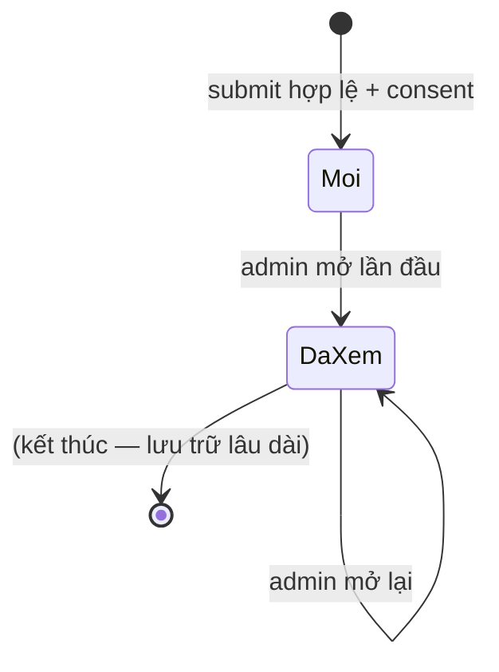
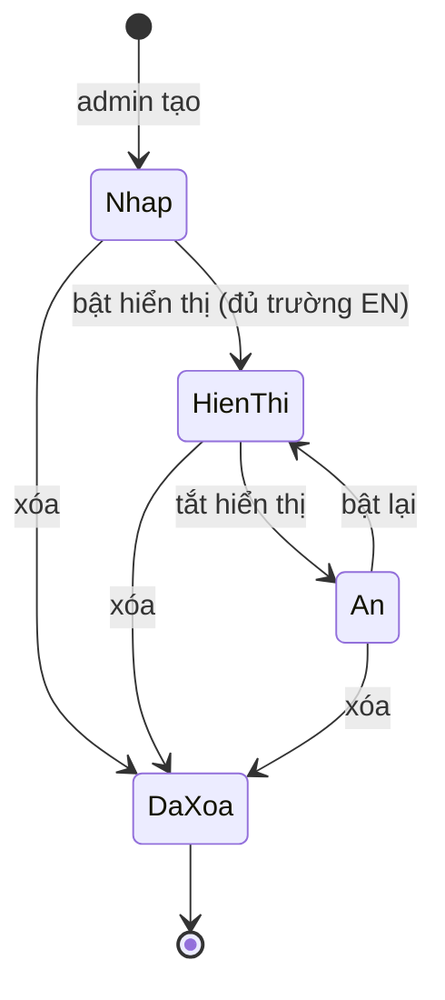
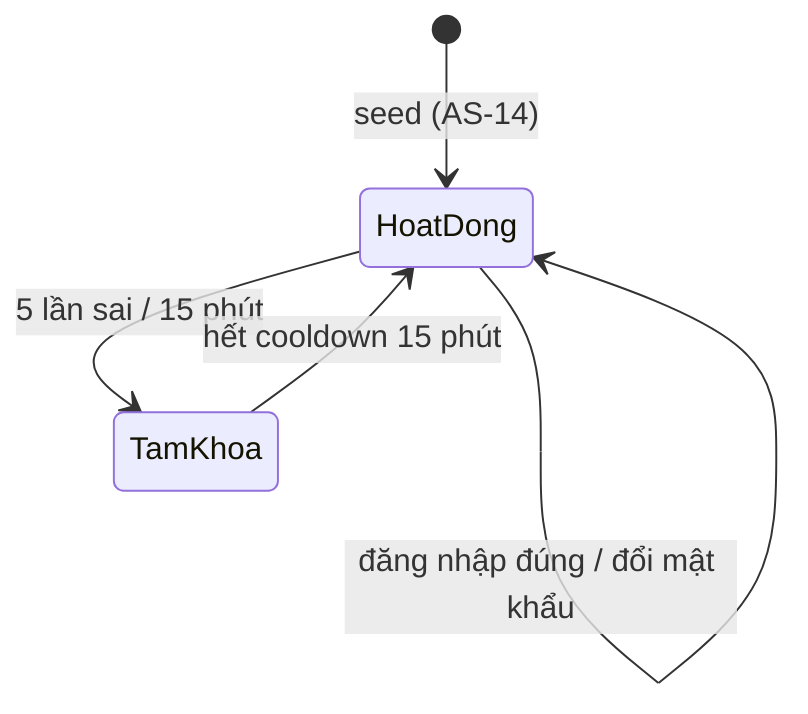
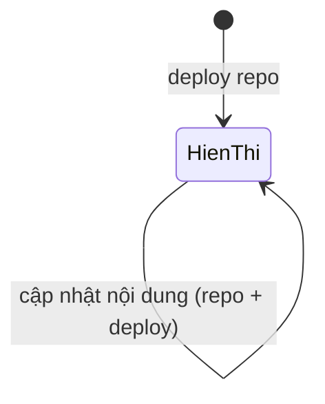

# ĐỐI TƯỢNG NGHIỆP VỤ — Vòng đời — Landing page dịch vụ B2B Mytel

| Phiên bản | v0.1 | Ngày | 2026-09-02 | Trạng thái | DONE |
|-----------|------|------|------------|------------|------|

> **Nền #2 của B2** — đối tượng nghiệp vụ (có trạng thái trên hệ thống), **không phải bảng DB** (map CSDL để SA làm ở LLD). Phát hiện từ `actor-usecase.md §4`. Mỗi FR nghiệp vụ trong SRS bám một hành động trên vòng đời (xem §2).

## 0. Danh mục đối tượng nghiệp vụ

| Mã | Đối tượng nghiệp vụ | Mô tả ngắn | Tập trạng thái | Ai sở hữu/tạo | Nhạy cảm (PDPL) |
|----|---------------------|------------|----------------|---------------|-----------------|
| E-01 | Lead | Yêu cầu tư vấn khách doanh nghiệp để lại qua form | Mới · Đã xem | Khách tạo; Admin đọc | **Có** (họ tên, email, SĐT, doanh nghiệp = PII) |
| E-02 | Content Block | Khối nội dung động do Admin quản (3 loại: Highlight/Đối tác/Con số) | Nháp · Hiển thị · Ẩn · Đã xóa | Content Admin | Không (nội dung công khai; ẩn doanh thu — Q8) |
| E-03 | Admin Account | Tài khoản đăng nhập trang quản trị | Hoạt động · Tạm khóa | Seed từ AS-14 | **Có** (email + mật khẩu băm) |
| E-04 | Service | Một trong 18 dịch vụ B2B trong catalog | Hiển thị | Nội dung repo (Q7) | Không (nội dung public từ Excel) |

## 1. Vòng đời từng đối tượng

### E-01 · Lead

- **Định danh & thuộc tính nghiệp vụ chính:** mã lead, họ tên người liên hệ, email công việc, số điện thoại, tên doanh nghiệp, dịch vụ quan tâm, lời nhắn, thời điểm gửi, ngôn ngữ trang lúc gửi, trạng thái đã-xem. (SA quyết lưu bảng nào ở LLD.)
- **Trạng thái ban đầu / kết thúc:** sinh ra ở `Mới`; trạng thái nghỉ (resting) `Đã xem`. Không có xóa/hủy runtime ở MVP.

**1a. CRUD + hành trình (đủ 5 nhóm):**

| Hành động | Khi nào / Ai làm | Điều kiện (trạng thái cho phép) | Kết quả (trạng thái đích) | Ghi chú |
|-----------|------------------|----------------------------------|----------------------------|---------|
| **Khởi tạo** (Create) | Khách submit form hợp lệ + consent = true + qua chống spam (UC-05) | — | `Mới` | Side-effect: gửi email báo Sale (FR-09) |
| **Danh sách / Tìm** (List) | Content Admin (UC-13) | mọi trạng thái | (không đổi) | Lọc theo trạng thái/ngày/dịch vụ; sắp theo thời điểm gửi giảm dần; phân trang 20/trang |
| **Xem chi tiết** (Read) | Content Admin (UC-13) | mọi trạng thái | `Mới` → `Đã xem` (lần mở đầu) | Mở lead `Mới` lần đầu đánh dấu `Đã xem`; mở lại `Đã xem` không đổi |
| **Cập nhật** (Update) | — | **KHÓA ở mọi trạng thái** | (không đổi) | MVP không cho sửa trường lead (BR-18: chỉ đọc) — giữ nguyên bản khách gửi |
| **Hủy / Xóa** (Delete) | — | **Ngoài phạm vi MVP** | — | Không có xóa runtime; retention & xóa theo yêu cầu PDPL xử lý thủ công (NFR-04) — [quy trình retention: cần anh Bryan cung cấp] |

**1b. Máy trạng thái:**

| Trạng thái nguồn | Sự kiện | Điều kiện | Trạng thái đích | Hành động / side-effect |
|------------------|---------|-----------|-----------------|--------------------------|
| — | Khách submit form | Validate đạt + consent=true + chống spam đạt | `Mới` | C Lead; gửi email báo Sale (A-04) |
| `Mới` | Admin mở chi tiết lần đầu | Admin đã đăng nhập | `Đã xem` | U Lead.đãXem=true; ghi audit log |
| `Đã xem` | Admin mở lại | Admin đã đăng nhập | `Đã xem` | (không đổi) |

**1c. Sơ đồ trạng thái:**

**1d. Ma trận Trạng thái × Hành động:**

| Trạng thái \ Hành động | Xem | Sửa trường | Xóa | Đánh dấu Đã xem |
|------------------------|:---:|:---:|:---:|:---:|
| `Mới` | ✓ | ✗ (khóa MVP) | ✗ (ngoài phạm vi) | ✓ (tự động khi mở) |
| `Đã xem` | ✓ | ✗ (khóa MVP) | ✗ (ngoài phạm vi) | — (đã đánh dấu) |

- **Truy vết:** FR-07, FR-08, FR-09, FR-10, FR-11.

---

### E-02 · Content Block *(3 loại chung 1 vòng đời)*

- **Định danh & thuộc tính nghiệp vụ chính:** mã khối, loại (`Highlight` | `Đối tác` | `Con số`), nội dung song ngữ EN/VI theo loại (xem bảng trường ở SRS FR-12/13/14), thứ tự hiển thị, trạng thái. (SA quyết bảng ở LLD.)
- **Trạng thái ban đầu / kết thúc:** sinh ra ở `Nháp`; trạng thái cuối `Đã xóa` (soft-delete, terminal).
- **Đăng thẳng (Q10):** không có trạng thái "chờ duyệt" giữa `Nháp` và `Hiển thị`.

**1a. CRUD + hành trình (đủ 5 nhóm):**

| Hành động | Khi nào / Ai làm | Điều kiện (trạng thái cho phép) | Kết quả (trạng thái đích) | Ghi chú |
|-----------|------------------|----------------------------------|----------------------------|---------|
| **Khởi tạo** (Create) | Admin tạo khối mới (UC-09/10/11) | — | `Nháp` | Nhập trường bắt buộc EN tối thiểu; VI khuyến nghị |
| **Danh sách / Tìm** (List) | Admin (mọi trạng thái trừ Đã xóa) | mọi trạng thái | (không đổi) | Lọc theo loại/trạng thái; sắp theo thứ tự hiển thị |
| **Xem chi tiết** (Read) | Admin (quản trị) / Khách (chỉ bản công khai) | Admin: mọi trạng thái; Khách: chỉ `Hiển thị` | (không đổi) | Public chỉ đọc khối `Hiển thị` đủ bản dịch của ngôn ngữ đang xem (BR-DYN-01) |
| **Cập nhật** (Update) | Admin sửa nội dung/ảnh/link/thứ tự | `Nháp`, `Hiển thị`, `Ẩn` | (không đổi trạng thái) | Sửa khối `Hiển thị` cập nhật public trong ≤ TTL cache (NFR-01); không sửa khối `Đã xóa` |
| **Hủy / Xóa** (Delete) | Admin xóa khối (UC-09/10/11) | `Nháp`, `Hiển thị`, `Ẩn` | `Đã xóa` (soft-delete) | Ẩn khỏi cả public lẫn danh sách mặc định; khôi phục = ngoài phạm vi MVP |

**Hành động nghiệp vụ riêng — Bật/Ẩn & Sắp thứ tự (UC-12, FR-15):**

| Hành động | Điều kiện | Kết quả |
|-----------|-----------|---------|
| Bật hiển thị (Publish) | `Nháp` hoặc `Ẩn`, và có đủ trường bắt buộc EN | → `Hiển thị` |
| Tắt hiển thị (Ẩn) | `Hiển thị` | → `Ẩn` |
| Sắp thứ tự | `Hiển thị`/`Ẩn`/`Nháp` | (không đổi trạng thái; đổi thứ tự) |

**1b. Máy trạng thái:**

| Trạng thái nguồn | Sự kiện | Điều kiện | Trạng thái đích | Side-effect |
|------------------|---------|-----------|-----------------|-------------|
| — | Admin tạo khối | — | `Nháp` | C ContentBlock; audit log |
| `Nháp` | Admin bật hiển thị | đủ trường bắt buộc EN | `Hiển thị` | U trạng thái; public thấy sau ≤ TTL; audit log |
| `Nháp` | Admin bật hiển thị | thiếu trường bắt buộc EN | `Nháp` | chặn + báo lỗi (không đổi) |
| `Hiển thị` | Admin tắt hiển thị | — | `Ẩn` | public không còn thấy sau ≤ TTL; audit log |
| `Ẩn` | Admin bật lại | đủ trường bắt buộc EN | `Hiển thị` | public thấy lại sau ≤ TTL; audit log |
| `Nháp`/`Hiển thị`/`Ẩn` | Admin xóa | — | `Đã xóa` | soft-delete; public không thấy; audit log |

**1c. Sơ đồ trạng thái:**

**1d. Ma trận Trạng thái × Hành động:**

| Trạng thái \ Hành động | Xem (admin) | Xem (public) | Sửa | Bật hiển thị | Tắt hiển thị | Sắp thứ tự | Xóa |
|------------------------|:---:|:---:|:---:|:---:|:---:|:---:|:---:|
| `Nháp` | ✓ | ✗ | ✓ | ✓ | ✗ | ✓ | ✓ |
| `Hiển thị` | ✓ | ✓ | ✓ | ✗ | ✓ | ✓ | ✓ |
| `Ẩn` | ✓ | ✗ | ✓ | ✓ | ✗ | ✓ | ✓ |
| `Đã xóa` | ✗ (ẩn khỏi DS) | ✗ | ✗ | ✗ | ✗ | ✗ | ✗ |

- **Truy vết:** FR-02, FR-12, FR-13, FR-14, FR-15.

---

### E-03 · Admin Account

- **Định danh & thuộc tính nghiệp vụ chính:** email đăng nhập, mật khẩu (băm — không lưu thô), trạng thái, số lần đăng nhập sai liên tiếp, mốc khóa. (SA quyết bảng ở LLD.)
- **Trạng thái ban đầu / kết thúc:** seed ở `Hoạt động` (từ AS-14). `Tạm khóa` là trạng thái tạm; tự về `Hoạt động` sau cooldown. Vô hiệu hóa vĩnh viễn = ngoài phạm vi MVP (1 admin).

**1a. CRUD + hành trình (đủ 5 nhóm):**

| Hành động | Khi nào / Ai làm | Điều kiện | Kết quả | Ghi chú |
|-----------|------------------|-----------|---------|---------|
| **Khởi tạo** (Create) | Seed lúc triển khai từ AS-14 (DevOps) | — | `Hoạt động` | Không có màn "đăng ký admin" trên UI (chống tạo tài khoản trái phép) |
| **Danh sách / Tìm** (List) | — | — | — | 1 admin (Q9) → không có màn quản lý danh sách tài khoản ở MVP |
| **Xem chi tiết** (Read) | Admin xem hồ sơ mình (email) | `Hoạt động` | (không đổi) | Không hiển thị mật khẩu |
| **Cập nhật** (Update) | Admin đổi mật khẩu (UC-07 phần hồ sơ) | `Hoạt động` | (không đổi) | Mật khẩu mới ≥ 12 ký tự (NFR-03) |
| **Hủy / Kết thúc** | Vô hiệu hóa vĩnh viễn | **Ngoài phạm vi MVP** | — | Offboard admin xử lý qua đổi seed/DevOps — [cần anh Bryan cung cấp quy trình] |

**Hành động nghiệp vụ riêng — Đăng nhập / Khóa:**

| Hành động | Điều kiện | Kết quả |
|-----------|-----------|---------|
| Đăng nhập đúng | `Hoạt động`, mật khẩu khớp | tạo phiên 30 phút; reset đếm sai = 0 |
| Đăng nhập sai | `Hoạt động` | đếm sai +1; nếu đạt 5 trong 15 phút → `Tạm khóa` |
| Đăng nhập khi đang khóa | `Tạm khóa` | từ chối, báo thời gian mở khóa |
| Hết cooldown | `Tạm khóa`, đủ 15 phút từ mốc khóa | → `Hoạt động`; đếm sai = 0 |

**1b. Máy trạng thái:**

| Trạng thái nguồn | Sự kiện | Điều kiện | Trạng thái đích | Side-effect |
|------------------|---------|-----------|-----------------|-------------|
| — | Seed triển khai | — | `Hoạt động` | tạo tài khoản từ AS-14 |
| `Hoạt động` | Đăng nhập sai lần thứ 5/15 phút | đủ ngưỡng | `Tạm khóa` | ghi mốc khóa; audit log (cảnh báo) |
| `Tạm khóa` | Đủ 15 phút | hết cooldown | `Hoạt động` | reset đếm sai |
| `Hoạt động` | Đăng nhập đúng | mật khẩu khớp | `Hoạt động` | tạo phiên; reset đếm sai |

**1c. Sơ đồ trạng thái:**

**1d. Ma trận Trạng thái × Hành động:**

| Trạng thái \ Hành động | Đăng nhập | Đổi mật khẩu | Truy cập trang quản trị | Bị khóa tự động |
|------------------------|:---:|:---:|:---:|:---:|
| `Hoạt động` | ✓ | ✓ | ✓ (khi có phiên) | ✓ (khi đạt ngưỡng sai) |
| `Tạm khóa` | ✗ (báo thời gian mở khóa) | ✗ | ✗ | — |

- **Truy vết:** FR-16, FR-17, FR-18.

---

### E-04 · Service *(vòng đời tối giản — Q7 giữ trong repo)*

- **Định danh & thuộc tính nghiệp vụ chính:** mã dịch vụ, nhóm (Connectivity/Mobile ICT/ICT Service), 8 trường từ Excel (Tên · Nhóm · What is · Advantage · Target Customer · Target Sale · Delivery Timeline · Price Policy), bản dịch EN/VI. Giá **ẩn** trên UI (Q3), trường Price Policy không hiển thị công khai.
- **Trạng thái ban đầu / kết thúc:** nội dung tĩnh trong repo; sau deploy luôn ở `Hiển thị`.

**1a. CRUD + hành trình (đủ 5 nhóm):**

| Hành động | Khi nào / Ai làm | Điều kiện | Kết quả | Ghi chú |
|-----------|------------------|-----------|---------|---------|
| **Khởi tạo** | Dev thêm bản ghi nội dung vào repo + deploy | — | `Hiển thị` | 18 dịch vụ đợt 1 (Q4 = đủ 18) |
| **Danh sách / Tìm** | Khách duyệt 3 nhóm (UC-02) | `Hiển thị` | (không đổi) | Grid theo 3 nhóm; không có tìm kiếm nâng cao ở MVP |
| **Xem chi tiết** | Khách mở trang dịch vụ (UC-03) | `Hiển thị` | (không đổi) | 8 trường nguồn, hiển thị 7 (ẩn Price Policy); URL riêng mỗi dịch vụ |
| **Cập nhật** | Dev sửa nội dung trong repo + deploy | `Hiển thị` | `Hiển thị` | Không có CRUD runtime cho actor (Q7) |
| **Gỡ/Ẩn** | Dev gỡ khỏi repo + deploy | `Hiển thị` | (không còn trong catalog) | Không có "ẩn" runtime |

**1b. Máy trạng thái:**

| Trạng thái nguồn | Sự kiện | Điều kiện | Trạng thái đích | Side-effect |
|------------------|---------|-----------|-----------------|-------------|
| — | Deploy repo có bản ghi dịch vụ | — | `Hiển thị` | render trang chi tiết + card |
| `Hiển thị` | Deploy repo sửa nội dung | — | `Hiển thị` | cập nhật nội dung |

**1c. Sơ đồ trạng thái:**

**1d. Ma trận Trạng thái × Hành động:**

| Trạng thái \ Hành động | Xem DS | Xem chi tiết | Cập nhật runtime | Ẩn runtime |
|------------------------|:---:|:---:|:---:|:---:|
| `Hiển thị` | ✓ | ✓ | ✗ (qua repo/deploy) | ✗ (qua repo/deploy) |

> Vòng đời tối giản có một trạng thái ổn định `Hiển thị` (không phải trạng thái chết: có lối vào từ deploy và tự-lặp khi cập nhật). Việc thêm/sửa/gỡ nằm ngoài runtime nên không sinh chuyển trạng thái cho actor.

- **Truy vết:** FR-04, FR-05, FR-06.

## 2. Bản đồ FR ↔ Đối tượng nghiệp vụ ↔ Trạng thái

| FR | Đối tượng nghiệp vụ | Hành động | Trạng thái nguồn → đích |
|----|---------------------|-----------|--------------------------|
| FR-01 | Content Block, Service | Đọc (render landing) | (đọc `Hiển thị`) |
| FR-02 | Content Block | Đọc bản công khai | (đọc `Hiển thị` theo ngôn ngữ) |
| FR-03 | Content Block, Service | Đọc theo ngôn ngữ | (không đổi) |
| FR-04 | Service | Danh sách/Duyệt | (đọc `Hiển thị`) |
| FR-05 | Service | Xem chi tiết | (đọc `Hiển thị`) |
| FR-06 | Service, Lead | Điều hướng CTA | (không đổi) |
| FR-07 | Lead | Khởi tạo (validate + consent) | — → `Mới` |
| FR-08 | Lead | Lưu | — → `Mới` |
| FR-09 | Lead | Side-effect gửi email | `Mới` (gửi báo Sale) |
| FR-10 | Lead | Chặn tạo khi spam | (không sinh `Mới`) |
| FR-11 | Lead | Danh sách + chi tiết | `Mới` → `Đã xem` |
| FR-12 | Content Block (Highlight) | CRUD | — → `Nháp`; sửa/xóa |
| FR-13 | Content Block (Đối tác) | CRUD | — → `Nháp`; sửa/xóa |
| FR-14 | Content Block (Con số) | CRUD | — → `Nháp`; sửa/xóa |
| FR-15 | Content Block | Bật/Ẩn/Sắp thứ tự | `Nháp`/`Ẩn` → `Hiển thị`; `Hiển thị` → `Ẩn` |
| FR-16 | Admin Account | Đăng nhập / khóa | `Hoạt động` ↔ `Tạm khóa` |
| FR-17 | Admin Account | Đăng xuất / hết phiên | (kết thúc phiên) |
| FR-18 | Admin Account, Content Block, Lead | Ghi audit log | (side-effect mọi thao tác quản trị) |

---

## ✅ Checklist vòng đời
- [x] 4 đối tượng lõi nhận diện từ actor-usecase (không từ bảng DB).
- [x] Mỗi đối tượng đủ 5 nhóm hành trình; trạng thái đích rõ ràng (khóa/ngoài-phạm-vi ghi rõ, không ô trống).
- [x] Máy trạng thái đủ lối vào/ra; không trạng thái chết (Đã xem/Hiển thị có nghĩa nghỉ hoặc lối ra; Service `Hiển thị` tự-lặp có lối vào).
- [x] Cập nhật: nói rõ trường sửa được ở trạng thái nào (Lead khóa; Content Block sửa ở Nháp/Hiển thị/Ẩn).
- [x] Hủy/Kết thúc: Content Block soft-delete → `Đã xóa`; Lead/Admin ghi rõ ngoài phạm vi MVP.
- [x] Ma trận trạng thái × hành động khớp máy trạng thái.
- [x] Mọi FR ánh xạ về một hành động trên vòng đời (§2).
- [x] Nhạy cảm PDPL đánh dấu (Lead, Admin Account); ví dụ dùng dữ liệu ẩn danh.
