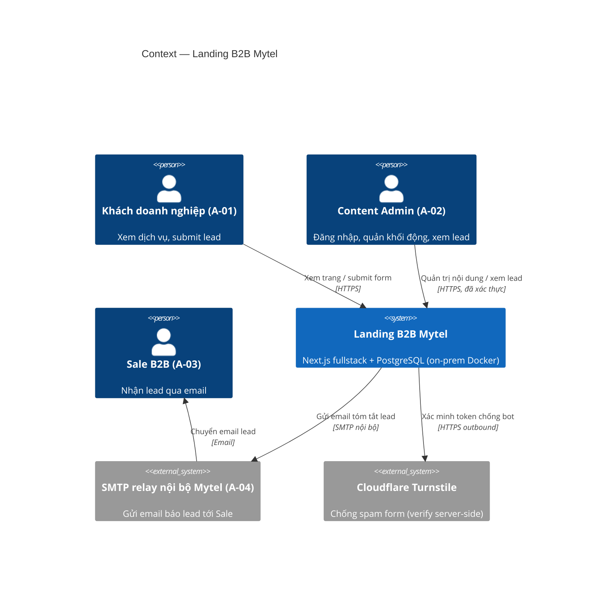
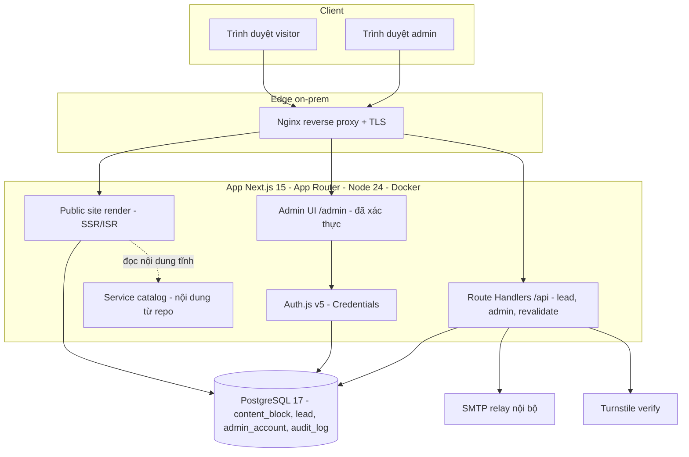
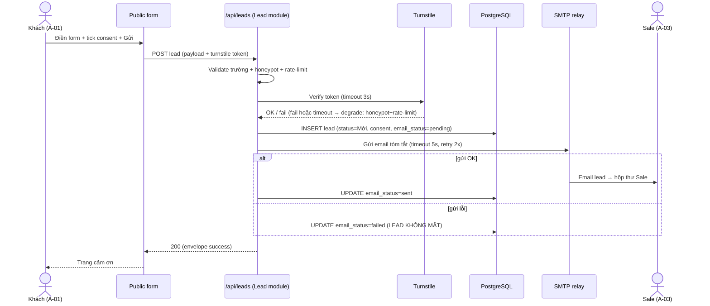

# HLD — Landing page dịch vụ B2B Mytel (+ Admin CMS-lite)

| Phiên bản | v1.0 | Ngày | 2026-09-02 | Trạng thái | DONE (chờ GATE-2) |
|-----------|------|------|------------|------------|-------------------|

> **Nguồn:** BRD v0.2 (`docs/ba/BRD.md`), actor & use case (`docs/ba/actor-usecase.md`), `arch-proposal.md`, và quyết định B2 của anh Bryan (`docs/_eval/decisions.md`).
> **Kiến trúc & version đã chốt (anh Bryan 2026-09-02):** Next.js fullstack (App Router) modular monolith · PostgreSQL · toàn bộ version V1–V13 (xem `techstack.md`).
> **Điều chỉnh hosting V11 (anh Bryan 2026-09-04):** hybrid — **Production on-prem Docker · UAT Vercel · code cloud-agnostic** (xem §8 + **ADR-09**). Data model / module / API **không đổi**.
> **✅ Đã đối chiếu SRS v0.1 (`docs/ba/SRS.md`, 2026-09-02):** FR-01..FR-18 + NFR-01..NFR-10 đã map vào HLD/techstack. 5 module HLD = 5 nhóm nghiệp vụ G1–G5 của SRS. Kết quả đối chiếu ở cuối tài liệu (mục "Đối chiếu SRS↔HLD (GATE-2)").

---

## 1. Quyết định kiểu kiến trúc *(làm TRƯỚC khi vẽ component)*

| Câu hỏi quyết định | Trả lời (trích BRD/actor-usecase) | Nghiêng |
|--------------------|-----------------------------------|---------|
| Quy mô người dùng | Landing marketing, ước < vài chục nghìn visit/tháng, peak thấp; đọc >> ghi; lead vài chục–vài trăm/tháng; **1 admin** | **Monolith/Modular** |
| Số miền nghiệp vụ & độ độc lập | **1 miền** (marketing site + CMS-lite), 4 đối tượng nghiệp vụ (Lead, Content Block, Admin Account, Service) gắn kết chặt | **Monolith/Modular** |
| Triển khai/mở rộng độc lập từng phần | Không cần — trọn gói 1 app là đủ; public & admin cùng vòng đời | **Monolith/Modular** |
| Số đội song song & tần suất release | **1 đội**, release theo đợt | **Monolith/Modular** |
| Năng lực vận hành phân tán | On-prem Docker Compose, chưa có hạ tầng microservices | **Monolith/Modular** |

**Kết luận: MODULAR MONOLITH** — một app Next.js (App Router) duy nhất, **chung 1 CSDL PostgreSQL**, chia **module nội bộ theo nghiệp vụ** để dễ đọc/bảo trì và mở đường tách service sau nếu cần. Không microservices (đúng BRD §7 + anh Bryan chốt PA A).

*Lý do đóng:* quy mô nhỏ + 1 miền + 1 đội + 1 admin + đọc-nhiều-ghi-ít → microservices là over-engineering; monolith rẻ, nhanh ra MVP (yêu cầu #1) và dễ vận hành on-prem.

**Ranh giới module = ranh giới nghiệp vụ** (đồng nhất 5 nhóm BA chốt trong `actor-usecase.md §5`): **Public site · Service catalog · Lead · Admin content · Admin auth**. Trong monolith, mỗi nhóm ⇔ một **package/thư mục** riêng (không tách service).

---

## 2. Tổng quan kiến trúc

### 2.1 C4 — Mức 1: Context



### 2.2 C4 — Mức 2: Container



> Tất cả container chạy **trong 1 app Next.js** (modular monolith) + PostgreSQL + Nginx, đóng gói bằng **Docker Compose on-prem**. "Container" ở đây theo nghĩa C4 (đơn vị chạy được / lớp) — không phải nhiều microservice.

---

## 3. Thành phần chính (C4 mức 3 — Component/Module nội bộ)

| Module (= nhóm SRS) | Trách nhiệm | FR phục vụ (SRS) | Dữ liệu sở hữu | Phụ thuộc |
|---------------------|-------------|------------------|----------------|-----------|
| **Public site (G1)** | Render landing (hero + Why/Coverage/Capabilities/Register) + khối động; i18n EN/VI (thiếu bản dịch → ẩn khối, BR-DYN-01); SEO/OG; scroll-reveal nhẹ | FR-01, FR-02, FR-03 | — (đọc `content_block`, `service`) | Admin content (dữ liệu), Service catalog |
| **Service catalog (G2)** | 18 trang chi tiết dùng chung 1 template (8 trường Excel, Price Policy ẩn), URL riêng, CTA prefill; **nội dung trong repo (Q7)** | FR-04, FR-05, FR-06 | Nội dung dịch vụ (file repo, i18n) | Public site (layout), Lead (CTA) |
| **Lead (G3)** | Nhận & validate form, chống spam (Turnstile+honeypot+rate-limit 5/IP/giờ), lưu lead + consent (nguyên tử), gửi email báo Sale (có fallback), **Admin xem lead (Mới→Đã xem)** | FR-07, FR-08, FR-09, FR-10, **FR-11** | `lead` (+consent) | Turnstile, SMTP, DB, Admin auth (bảo vệ xem lead) |
| **Admin content (G4)** | CRUD 3 loại khối (Highlight/Partner/Stat) đa ngữ, bật/ẩn (chặn bật khi thiếu trường EN, CB-010), sắp thứ tự, **đăng thẳng**; trigger revalidate public | FR-12, FR-13, FR-14, FR-15 | `content_block` (+i18n) | Admin auth, DB, cache/revalidate |
| **Admin auth (G5)** | Đăng nhập/đăng xuất (session 30 phút), chống brute-force (khóa 5 lần sai/15 phút), **audit log mọi thao tác quản trị** | FR-16, FR-17, **FR-18** | `admin_account`, `audit_log` | Auth.js, DB |

> Chuẩn dùng chung cấp hệ (envelope/mã lỗi/auth/pagination/id/timezone/tracing) đặt tập trung — xem §7. Vì hệ **1 module vật lý** (BA để phẳng), không tạo `_overview/architecture.md` riêng; chuẩn dùng chung ghi ngay trong HLD này.

---

## 4. Mô hình dữ liệu (mức cao)

> Chi tiết cột/kiểu/index/ràng buộc → **LLD (B3, sau GATE-2)**. Đây là mức HLD: bảng chính + quan hệ + trạng thái. Sinh id: **ULID/UUID** (sortable, không lộ số lượng). Lưu thời gian **UTC**; hiển thị **Asia/Yangon** (+ VI dùng cùng mốc).

### 4.1 Bảng chính

| Bảng | Vai trò | Trường chính (mức cao) | Trạng thái (entity-lifecycle) | PII? |
|------|---------|------------------------|-------------------------------|:----:|
| **content_block** | Khối nội dung động (3 loại: `highlight`/`partner`/`stat`) | id, `block_type`, `status`, `sort_order`, `payload` (JSONB: ảnh/logo/link/giá trị-đơn vị — phần **không dịch**), audit (created_by/at, updated_by/at) | Nháp → **Hiển thị** ↔ Ẩn → Đã xóa (soft-delete) — E-02 | Không |
| **content_block_i18n** | Bản dịch từng khối theo locale | block_id (FK), `locale` (`en`/`vi`), `title`, `description`/`label` (phần **dịch được**) | theo khối cha | Không |
| **lead** | Lead từ form | id, company_name, contact_name, email, phone, `service_interest` (slug), message, `source`, `status`, `email_status` (`sent`/`failed`/`pending`), consent (given, text_version, at), created_at, viewed_at, viewed_by | **Mới** → Đã xem — E-01 | **CÓ** |
| **admin_account** | Tài khoản admin (seed từ AS-14) | id, email, `password_hash` (argon2id), `status` (`active`/`locked`), failed_attempts, locked_until, last_login_at | Hoạt động ↔ Tạm khóa — E-03 | Nhẹ (email nội bộ) |
| **audit_log** | Nhật ký thao tác admin | id, admin_id, `action`, entity_type, entity_id, at, ip, detail (JSONB) | append-only | Nhẹ |

**Ngoài DB — Service catalog (18 dịch vụ):** giữ **trong repo** dạng file cấu trúc i18n (Q7), **không có bảng DB**; entity E-04 chỉ trạng thái "Hiển thị". Sửa nội dung dịch vụ = qua repo + deploy (không phải runtime CRUD).

**Session:** dùng **Auth.js JWT session cookie** (httpOnly, SameSite, Secure) — **stateless**, không cần bảng session ở MVP (1 admin). Nếu cần thu hồi phiên chủ động sau này → thêm bảng session (ADR mới).

### 4.2 Quan hệ
- `content_block` 1—N `content_block_i18n` (mỗi khối có bản `en` + `vi`).
- `lead.viewed_by` → `admin_account.id`; `audit_log.admin_id` → `admin_account.id`.
- `content_block.created_by/updated_by` → `admin_account.id`.

---

## 5. Luồng dữ liệu chính

### 5.1 F-01 — Submit lead → lưu DB → email báo Sale (UC-05, FR-07/08/09/10)

**Degrade:** SMTP lỗi → lead vẫn lưu, gắn cờ `email_status=failed`, Admin thấy trong danh sách để xử lý thủ công. Đây là quyết định nghiệp vụ (không chặn khách vì lỗi hạ tầng gửi mail).

### 5.2 F-02 — Admin cập nhật khối → public thấy ≤10 phút (UC-09..12, FR-12..15, SC-09)
```mermaid
sequenceDiagram
  actor ADM as Content Admin (A-02)
  participant AUTH as Admin auth (middleware)
  participant ADMUI as Admin content
  participant DB as PostgreSQL
  participant RV as revalidateTag/Path
  participant PUB as Public (cache)
  ADM->>AUTH: (đã đăng nhập, session hợp lệ)
  ADM->>ADMUI: Tạo/sửa/bật-ẩn/sắp xếp khối (đa ngữ)
  ADMUI->>DB: UPSERT content_block + i18n; ghi audit_log
  ADMUI->>RV: revalidate tag "content-blocks"
  RV-->>PUB: Xóa cache liên quan
  Note over PUB: Request kế tiếp render lại từ DB → khách thấy NGAY (đăng thẳng, Q10)
```
**Cơ chế ≤10 phút:** **on-demand revalidation** khi admin lưu → public cập nhật ngay lần render kế tiếp (không chờ deploy). Fallback nếu on-demand lỗi: đặt `revalidate` ISR theo thời gian (ví dụ 300s) để tự làm mới, vẫn đạt ngưỡng ≤10 phút.

---

## 6. Tích hợp ngoài

| Hệ ngoài | Mục đích | Giao thức/Auth | Timeout / Retry / Breaker | Degrade mode |
|----------|----------|----------------|---------------------------|--------------|
| **SMTP relay nội bộ Mytel** | Gửi email báo lead cho Sale | SMTP (Nodemailer), cred từ secret | timeout 5s; retry 2x backoff | Lead vẫn lưu; `email_status=failed`; admin xử lý tay. **[relay endpoint + hộp thư Sale: chờ cấp]** |
| **Cloudflare Turnstile** | Xác minh chống bot server-side | HTTPS outbound, secret key | timeout 3s; không retry | Nếu chặn outbound/lỗi → dựa honeypot + rate-limit + heuristic (ghi log để rà) |

> Không có hệ ngoài đồng bộ nào nằm trong đường "chốt lead" bắt buộc → không cần circuit breaker phức tạp; đủ timeout + degrade.

---

## 7. Chuẩn dùng chung cấp hệ *(SA sở hữu — mọi module/dev bám; đổi = CR)*

- **Envelope API (JSON):**
  - Thành công: `{ "success": true, "data": <payload>, "meta": { "correlationId": "…" } }`
  - Lỗi: `{ "success": false, "error": { "code": "<MÃ>", "message": "<mô tả>" }, "meta": { "correlationId": "…" } }`
- **Taxonomy mã lỗi (nghiệp vụ):** `LEAD_VALIDATION`, `LEAD_SPAM_REJECTED`, `RATE_LIMITED`, `AUTH_INVALID_CREDENTIALS`, `AUTH_ACCOUNT_LOCKED`, `ADMIN_FORBIDDEN`, `CONTENT_NOT_FOUND`, `CONTENT_VALIDATION`, `INTERNAL_ERROR`. (Chi tiết bảng mã + HTTP status → LLD.)
- **Authn/authz:** Auth.js v5 Credentials; session = **JWT cookie httpOnly + Secure + SameSite=Lax**; hết hạn phiên 30 phút (UC-08). Route `/admin/*` và `/api/admin/*` chặn bởi **middleware** (chưa đăng nhập → 401/redirect login). RBAC tối giản: **1 vai `admin`** (Q9).
- **Pagination:** danh sách lead dùng **offset** (`page`, `pageSize`; mặc định 20) — khối lượng nhỏ, không cần cursor.
- **Versioning API:** prefix `/api/...`; khi cần phá vỡ tương thích → thêm nhánh version (chưa cần ở MVP).
- **Correlation id / tracing:** sinh `correlationId` mỗi request, đính vào log + envelope `meta`.
- **Timezone/locale:** lưu UTC; hiển thị **Asia/Yangon**; nội dung đa ngữ theo `locale` (`en`/`vi`, khung `my`).
- **Sinh id:** **ULID/UUID** (không auto-increment lộ số lượng lead).

---

## 8. Hạ tầng & Môi trường

> **Điều chỉnh V11 (anh Bryan chốt 2026-09-04 — delta GATE-2):** **DUNG HÒA hybrid hosting** — **Production = on-prem Docker; UAT = Vercel; code cloud-agnostic**. Chi tiết ở **ADR-09**. Data model / module / API **không đổi**.

- **Hai môi trường triển khai:**
  - **Production = on-prem Docker Compose** — dịch vụ: `web` (Next.js/Node 24, `node:24-bookworm-slim`), `db` (`postgres:17`), `proxy` (Nginx TLS). Là nơi **duy nhất chứa lead PII thật** (PDPL — §10). Secret (DB pass, SMTP cred, Turnstile key, Auth secret) qua biến môi trường/secret file — **không commit**.
  - **UAT = Vercel** — deploy nhanh để anh Bryan xem sớm; **dùng dữ liệu giả, KHÔNG đổ lead PII thật**. DB = Postgres managed/tạm (schema/migration Prisma dùng chung). Email: dùng email-API hoặc **tắt gửi thật** (không nối SMTP relay nội bộ ra ngoài).
- **Ràng buộc code cloud-agnostic (bắt buộc từ B4):** Next.js **`output: 'standalone'`**; **không dùng primitive khóa cứng Vercel** (edge-only, `@vercel/*`); **bọc email / lưu file / config qua interface** (on-prem = SMTP relay nội bộ ↔ UAT = email-API/tắt gửi); **1 codebase** chạy cả Docker lẫn Vercel; **Postgres 17** cho cả 2 đích.
- **Môi trường:** Dev (local) → **UAT (Vercel — dữ liệu giả)** → **Prod (on-prem Docker Compose — PII thật)**. DevOps (B6) làm **2 đích: docker-compose (prod) + cấu hình Vercel (UAT)**.
- **Trust boundary (prod on-prem):** chỉ Nginx expose ra ngoài (443). `web` và `db` trong mạng nội bộ Docker; `db` **không** expose public. Port giám sát tách khỏi port app (theo convention DevOps). *(UAT Vercel không chứa PII nên nằm ngoài ranh giới PDPL của prod.)*
- **Backup & khôi phục (DevOps sở hữu):** backup PostgreSQL **hằng ngày**; bật WAL/point-in-time nếu hạ tầng cho phép (ưu tiên cho bảng `lead`).
  - **RTO ≤ 4 giờ** (thời gian khôi phục dịch vụ tối đa) — *[đề xuất SA — chờ anh Bryan/DevOps xác nhận]*.
  - **RPO ≤ 24 giờ** (mất dữ liệu tối đa, theo backup hằng ngày); nếu bật WAL/PITR → RPO có thể xuống ~15 phút cho `lead` — *[đề xuất SA — chờ anh Bryan/DevOps xác nhận]*.
- **Dải port UAT/prod:** **chưa cấp — DevOps hỏi anh Bryan trước khi deploy.**

---

## 9. ⭐ Đối chiếu NFR định lượng *(kiến trúc phải chứng minh — đủ 10 NFR của SRS)*

> ID NFR lấy đúng từ `docs/ba/SRS.md §4` (NFR-01..NFR-10).

| NFR (SRS) | Yêu cầu đo được | Giải pháp kiến trúc đáp ứng | Điểm nghẽn dự kiến | Cách scale khi vượt |
|-----------|-----------------|------------------------------|---------------------|---------------------|
| **NFR-01** Hiệu năng | Lighthouse mobile ≥80; LCP<2.5s; TTFB P95 public <500ms; cache TTL khối động ≤60s | SSR/ISR + React Server Components (giảm JS client), Next/Image, data cache — cache-hit không chạm DB mỗi request | JS bundle/ảnh nặng; DB read khi revalidate | Code-split, nén ảnh; Redis cache (mở đường); read-replica |
| **NFR-02** Accessibility | Contrast ≥4.5:1 (WCAG 2.1 AA); `prefers-reduced-motion`; thao tác bàn phím; alt ảnh | Token màu đạt AA (Designer B3 kiểm); animation gate bởi media query; HTML ngữ nghĩa | Cặp màu cam/kem | Điều chỉnh token màu |
| **NFR-03** Bảo mật Admin | HTTPS; hash argon2id ≥12 ký tự; khóa 5 sai/15 phút; session 30 phút; chặn truy cập chưa xác thực (302) | Auth.js v5 + argon2id; middleware chặn `/admin/*`+`/api/admin/*`; đếm sai + `locked_until`; JWT cookie hết hạn 30 phút | brute-force | rate-limit chặt hơn, IP allowlist |
| **NFR-04** PDPL | Consent bắt buộc; PII qua TLS1.2+; không PII trong URL/log thô; retention/xóa theo yêu cầu | Nginx TLS; validate consent trước INSERT; redact PII trong log; endpoint xóa lead (vận hành); **PII thật chỉ ở prod on-prem; UAT Vercel dùng dữ liệu giả, không đổ lead PII thật** (ADR-09) | — | — |
| **NFR-05** i18n | EN+VI đầy đủ; khung `/en /vi /my` (MY ẩn); đổi ngôn ngữ không vỡ layout; thiếu bản dịch khối → ẩn ở ngôn ngữ thiếu (BR-DYN-01) | next-intl routing theo locale; `content_block_i18n` per-locale; lọc render theo đủ trường bắt buộc ngôn ngữ | — | thêm locale MY = thêm dữ liệu i18n |
| **NFR-06** Email lead | Lead tới Sale ≤1 giờ (mục tiêu ≤60s); retry ≤3; mất email không mất lead | Gửi đồng bộ + retry 3 lần/backoff; **fallback `email_status=failed`** giữ lead trong DB (ADR-07) | SMTP relay | Hàng chờ gửi lại; cảnh báo vận hành |
| **NFR-07** SEO | URL riêng `/{lang}/services/{slug}`; meta title/description theo ngôn ngữ; sitemap | SSR/ISR sinh URL tĩnh mỗi dịch vụ + metadata Next; sitemap sinh khi build | — | — |
| **NFR-08** Tương thích | 2 bản gần nhất Chrome/Edge/Safari/Firefox; responsive 360px→desktop | Next.js build đa trình duyệt; CSS responsive mobile-first | — | — |
| **NFR-09** Chống lạm dụng form | Rate-limit ≤5 submit/IP/giờ; honeypot ẩn | Kiểm server-side (rate-limit store + honeypot) trước khi tạo lead; Turnstile bổ trợ | Rate-limit store trong 1 node | Redis rate-limit khi tách/scale |
| **NFR-10** Sẵn sàng | Uptime public ≥99.5%/tháng (ngưỡng hạ tầng: [cần anh Bryan cấp]) | **Đo trên production on-prem** Docker + healthcheck + restart; backup ngày (UAT Vercel là môi trường xem trước, không tính SLA) | 1 node (monolith) | container restart; standby node sau |

**RTO/RPO (vận hành — §8, áp cho production on-prem):** **RTO ≤ 4h · RPO ≤ 24h** (backup hằng ngày; PITR có thể siết RPO `lead` ~15 phút) — *[đề xuất SA — chờ anh Bryan/DevOps xác nhận]*. *(UAT Vercel không đặt RTO/RPO — dữ liệu giả, có thể dựng lại.)*

---

## 10. Bảo mật & PDPL từ thiết kế

### 10.1 PII data-flow (Lead)
```
Visitor --HTTPS--> Nginx(TLS) --> API Lead --validate--> PostgreSQL(lead, on-prem)
                                          \--> SMTP nội bộ --> Email tóm tắt --> Hộp thư Sale
Admin --HTTPS, đã xác thực--> Đọc lead (authz)
```
- **PII trong hệ:** `lead` (tên, email, phone, message) — **chỉ nằm on-prem** (DB) + **nội dung email** gửi qua relay nội bộ. Không đẩy ra dịch vụ ngoài.
- **Bảo vệ:** TLS in-transit; giới hạn quyền đọc lead (chỉ admin xác thực); **redact email/phone trong log**; không đặt PII trên URL; consent bắt buộc trước khi lưu (SC-07); có **cơ chế xóa lead theo yêu cầu** (thiết kế endpoint xóa cho vận hành — dù UI MVP chưa cho admin xóa, BR-18).
- **Mã hóa at-rest:** đề xuất mã hóa volume/disk của `db` (on-prem) cho dữ liệu lead; cột nhạy cảm có thể mã hóa ứng dụng nếu Legal yêu cầu (LLD quyết).

### 10.2 Threat model sơ bộ (STRIDE — luồng chính)
| Luồng | Mối đe dọa | Giảm thiểu |
|-------|-----------|-----------|
| Đăng nhập admin | **S**poofing / brute-force | argon2id, khóa 5 lần/15 phút, rate-limit, session ngắn |
| Form lead | **T**ampering / spam bot | validate server-side, Turnstile+honeypot+rate-limit, không tin client |
| Xem lead | **I**nformation disclosure (lộ PII) | authz bắt buộc, redact log, chỉ Nginx expose |
| Đăng khối | **E**levation / sửa nội dung public trái phép | middleware chặn `/admin`, audit_log mọi thao tác (BR-19) |
| Toàn hệ | **R**epudiation | audit_log append-only (ai làm gì, khi nào) |

→ Security B5 rà sâu (OWASP Top 10 + pentest nội bộ) trên nền threat model này.

---

## 11. Quyết định kiến trúc (ADR)

| Mã | Tiêu đề | Bối cảnh | Phương án cân nhắc | Quyết định + lý do | Đánh đổi | Trạng thái |
|----|---------|----------|--------------------|--------------------|----------|------------|
| ADR-01 | Kiểu kiến trúc | Web app marketing + CMS-lite, quy mô nhỏ, 1 miền, 1 admin | Modular monolith / Microservices / Static+Headless CMS | **Modular monolith (Next.js fullstack)** — rẻ, nhanh MVP, đủ SEO + backend/DB | Public & admin cùng vòng đời deploy; 1 điểm hỏng | Active |
| ADR-02 | Nền tảng | Cần SSR/SEO public + API + admin trong 1 hệ | Next.js fullstack / FE+BE tách (NestJS/Spring) / SPA+CMS | **Next.js 15 App Router** — 1 codebase, SSR/ISR + Route Handlers | Gắn hệ Node/JS | Active |
| ADR-03 | CSDL | Lưu khối động đa ngữ + lead + admin | PostgreSQL / MySQL | **PostgreSQL 17** — JSONB đa ngữ, ổn định, hợp on-prem | — | Active |
| ADR-04 | Cập nhật nội dung động ≤10 phút | Marketing tự sửa không deploy (SC-09) | On-demand revalidate / SSR thuần / ISR thời gian | **On-demand revalidation + ISR fallback 300s** — cập nhật tức thì, giữ cache nhanh | Cần gọi revalidate đúng tag khi lưu | Active |
| ADR-05 | Auth admin | 1 admin, đăng nhập email/mật khẩu, chống brute-force | Auth.js Credentials / session tự xây / Lucia | **Auth.js v5 Credentials + argon2id**, JWT cookie | API v5 còn hoàn thiện → khóa version khi scaffold | Active |
| ADR-06 | Nội dung 18 dịch vụ | Q7: Admin chỉ quản khối động | Trong repo / Trong DB qua Admin | **Trong repo (file i18n)** — rẻ, nhanh; sửa qua deploy | Đổi nội dung dịch vụ cần deploy | Active |
| ADR-07 | Gửi email lead | Q1: lead → DB + email Sale, relay chưa chắc sẵn | Gửi đồng bộ / hàng đợi | **Gửi đồng bộ + fallback `email_status=failed`** (lead không mất) | Không có hàng đợi bền ở MVP | Active |
| ADR-08 | Hosting (bản gốc) | Anh Bryan chốt on-prem (PDPL) | On-prem Docker / Cloud+CDN | **On-prem Docker Compose** — lead nội bộ, hợp PDPL | Tự lo TLS/backup/scale | **Superseded bởi ADR-09** (prod giữ on-prem; thêm UAT Vercel) |
| ADR-09 | Hybrid hosting — prod on-prem, UAT Vercel, code cloud-agnostic | Điều chỉnh V11 (anh Bryan 2026-09-04): cần deploy nhanh cho anh xem sớm, nhưng lead PII thật phải giữ nội bộ (PDPL). Chỉ on-prem thì UAT chậm; chỉ cloud thì PII ra ngoài | (a) Chỉ on-prem Docker; (b) Chỉ Cloud+CDN (Vercel+managed PG); (c) **Hybrid: prod on-prem + UAT Vercel, code cloud-agnostic** | **(c) Hybrid** — **Production = on-prem Docker** (PII thật, giữ lý do PDPL của ADR-08); **UAT = Vercel** (deploy nhanh, **dữ liệu giả, không đổ PII thật**); **code cloud-agnostic**: `output:'standalone'`, không khóa cứng Vercel, bọc email/lưu file/config qua interface, 1 codebase + Postgres 17 cho cả 2 đích. DevOps B6 làm docker-compose (prod) + cấu hình Vercel (UAT) | Duy trì 2 đích triển khai + 2 cấu hình env; phải kỷ luật không dùng primitive độc quyền Vercel; UAT không phản ánh đúng ràng buộc mạng nội bộ (SMTP relay) của prod | **Active** (delta GATE-2 V11, pre-code) |

---

## ✅ Checklist SA (chiếu GATE-2)
- [x] Mỗi quyết định lớn có **ADR** (≥2 phương án, đánh đổi rõ).
- [x] Sơ đồ theo **C4** (Context/Container/Component) — component khớp 5 module BA chốt.
- [x] **Bảng NFR định lượng** đủ **NFR-01..NFR-10** của SRS + RTO/RPO (§9).
- [x] **Chuẩn dùng chung cấp hệ** chốt một nơi (§7).
- [x] Trust boundary + mã hóa + **PII data-flow (PDPL)** + threat model sơ bộ (§10).
- [x] Mỗi tích hợp ngoài có timeout/retry + **degrade mode** (§6).
- [x] **Đối chiếu SRS.md v0.1** (FR-01..18 + NFR-01..10) — xong (§12).
- [x] Sơ đồ kiến trúc khối `architecture.html` nhất quán với HLD.

---

## 12. Đối chiếu SRS↔HLD (GATE-2)

> Đối chiếu với `docs/ba/SRS.md v0.1` (2026-09-02): FR-01..FR-18, NFR-01..NFR-10, 5 nhóm G1–G5.

### 12.1 Ranh giới module ✅ khớp
5 module HLD **trùng khít** 5 nhóm nghiệp vụ SRS: **Public site (G1) · Service catalog (G2) · Lead (G3) · Admin content (G4) · Admin auth (G5)**. Cả hai đều để **1 module vật lý phẳng** (không tách `docs/modules/`).

### 12.2 Phủ FR — đủ 18/18
| Module | FR (SRS) | HLD phủ? |
|--------|----------|:--------:|
| G1 Public site | FR-01, FR-02, FR-03 | ✅ |
| G2 Service catalog | FR-04, FR-05, FR-06 | ✅ |
| G3 Lead | FR-07, FR-08, FR-09, FR-10, **FR-11** | ✅ (đã sửa) |
| G4 Admin content | FR-12, FR-13, FR-14, FR-15 | ✅ |
| G5 Admin auth | FR-16, FR-17, **FR-18** | ✅ (đã bổ sung) |

**Mismatch đã sửa khi đối chiếu:**
1. **FR-11 (Admin xem lead):** bản HLD đầu xếp nhầm sang *Admin content*; SRS xếp vào **G3 Lead** (đối tượng `lead`). → Đã chuyển FR-11 về **module Lead**. Data model đã sẵn (`lead.status Mới→Đã xem`, `viewed_by`, `viewed_at`) — không đổi bảng.
2. **FR-18 (Audit log thao tác quản trị):** bản HLD đầu chỉ nhắc qua BR-19, chưa nêu là FR. SRS có **FR-18 (G5)**. → Đã thêm FR-18 vào **module Admin auth**. Bảng `audit_log` đã có sẵn từ đầu — không đổi data model. *Lưu ý cross-cutting:* FR-18 ghi log cho cả thao tác của G3 (mở lead) và G4 (CRUD khối); FR do G5 sở hữu, nhưng các module kia **gọi ghi audit** khi thao tác (đã phản ánh ở luồng F-02 và FR-11).

### 12.3 Phủ NFR — đủ 10/10
NFR-01..NFR-10 đã map 1-1 vào **bảng §9** (thay các tham chiếu tạm BG-06/SC-xx trước đây). techstack.md cột "NFR liên quan" cũng đã cập nhật sang ID NFR thật.

### 12.4 Thành phần HLD không có FR trực tiếp (đúng kỳ vọng — phục vụ NFR)
- **Nginx (TLS)** → NFR-03, NFR-04. **ISR/Data cache** → NFR-01. **Secret/ENV** → NFR-03/04. **audit_log** → FR-18/NFR-03. Đây là hạ tầng/cross-cutting, phục vụ NFR chứ không phải FR nghiệp vụ — hợp lệ.

### 12.5 Điểm còn lệch/treo cần PO/anh Bryan quyết
- **RTO/RPO** (§8/§9): đề xuất RTO≤4h, RPO≤24h — *chờ anh Bryan/DevOps xác nhận*.
- **NFR-10 uptime** ngưỡng hạ tầng thực tế: *chờ anh Bryan cấp*.
- **NFR-04 retention/xóa lead**: quy trình xóa theo yêu cầu chủ thể dữ liệu *chờ Legal/anh Bryan*.
- **AS-09 địa chỉ Sale + SMTP relay** (FR-09/NFR-06): *chờ cấp trước B4*.
- **Chi tiết mã lỗi** (LEAD-xxx/AUTH-xxx/CB-xxx/I18N-xxx của SRS) sẽ ánh xạ đầy đủ vào **taxonomy mã lỗi §7** ở **LLD (B3)** — HLD giữ mức nhóm.
