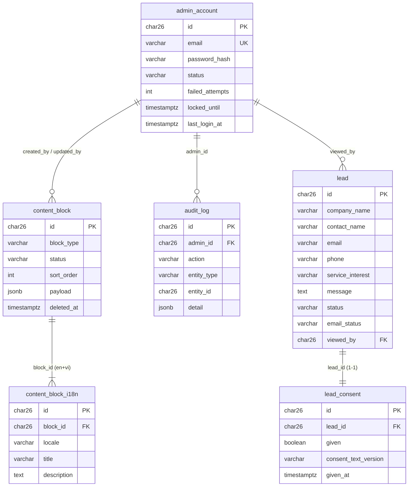
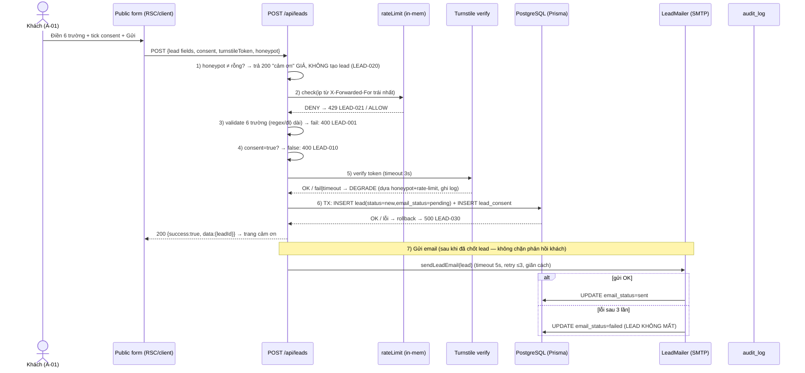
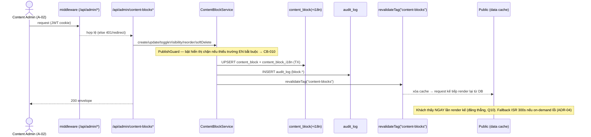

# LLD — Landing page dịch vụ B2B Mytel (+ Admin CMS-lite)

| Phiên bản | v1.0 | Ngày | 2026-09-02 | Trạng thái | DONE (chờ GATE-3) |
|-----------|------|------|------------|------------|-------------------|

> **Nguồn:** HLD v1.0 (`docs/sa/HLD.md`), techstack v1.0 (`docs/sa/techstack.md`), SRS v0.1 (`docs/ba/SRS.md`). GATE-2 đã DUYỆT (anh Bryan, 2026-09-02).
> **Kiến trúc chốt:** Next.js 15 App Router · **modular monolith** · PostgreSQL 17 · Prisma 6 · Auth.js v5 (Credentials + argon2id) · next-intl 3 · on-prem Docker. 5 module nội bộ **G1–G5** = Public site · Service catalog · Lead · Admin content · Admin auth.
> **Nguồn sự thật:** tên bảng/cột/enum ở tài liệu này là **canonical** cho code (B4) và `api-spec.md`. Đổi = Change Request sau GATE-3.
> **Không viết code thật ở đây** (đó là B4). LLD là thiết kế để dev hiện thực.

---

## 0. Quy ước chung LLD

- **Sinh id:** **ULID** (26 ký tự Crockford Base32, sortable theo thời gian, không lộ số lượng — HLD §7). Lưu Postgres kiểu `CHAR(26)`. Prisma: `String @id`, giá trị sinh ở tầng ứng dụng (thư viện `ulid`), **không** dùng auto-increment.
- **Thời gian:** cột `*_at` kiểu `TIMESTAMPTZ`, lưu **UTC**; hiển thị **Asia/Yangon** ở tầng UI (HLD §7).
- **Locale:** enum `en` · `vi` (khung `my` chưa bật — NFR-05). Nội dung động đa ngữ tách bảng i18n; message UI tĩnh trong file (next-intl).
- **Soft-delete:** dùng cột `deleted_at TIMESTAMPTZ NULL`; bản ghi có `deleted_at IS NOT NULL` bị loại khỏi mọi truy vấn public và admin (trừ khôi phục/audit).
- **PII (PDPL):** đánh dấu cột ở cột "Nhạy cảm?"; PII **không** đưa vào URL/query/log thô (NFR-04). Log ghi **mã lead** thay vì nội dung.
- **Envelope & mã lỗi:** theo **HLD §7** (không dùng `TransactionResponse` của template Java — dự án này là Next.js). Chi tiết bảng mã lỗi ở §8.

---

## 1. Data model chi tiết

### 1.1 ERD (Mermaid)



> **Quyết định LLD (chuẩn hoá so với HLD §4):** HLD mô tả consent **nội tuyến** trong `lead`. Ở mức thiết kế vật lý, LLD **tách bảng `lead_consent` (1-1)** để giữ **bản ghi consent bất biến** phục vụ PDPL (ghi lại đúng phiên bản văn bản đồng ý đã hiển thị + thời điểm + IP). Đây là chi tiết vật lý, **không mâu thuẫn** HLD (cùng dữ liệu, chuẩn hoá thêm). Ghi `lead` + `lead_consent` trong **một transaction nguyên tử** (FR-08).

### 1.2 Bảng `content_block` — khối nội dung động (E-02) · FR-02/12/13/14/15

| Cột | Kiểu & độ dài | Null? | Khóa | Chỉ mục | Mặc định | Nhạy cảm? | Ràng buộc / mô tả |
|-----|---------------|:-----:|------|---------|----------|:---------:|-------------------|
| id | CHAR(26) ULID | N | PK | | (app-gen) | | |
| block_type | VARCHAR(16) | N | | `idx_cb_type_status_sort` | | | CHECK ∈ `highlight`·`partner`·`stat` |
| status | VARCHAR(12) | N | | `idx_cb_type_status_sort` | `draft` | | CHECK ∈ `draft`·`visible`·`hidden`·`deleted` (E-02: Nháp→Hiển thị↔Ẩn→Đã xóa) |
| sort_order | INTEGER | N | | `idx_cb_type_status_sort` | 0 | | CHECK ≥ 0 (FR-15) |
| payload | JSONB | N | | (GIN nếu cần) | `'{}'` | | phần **không dịch**: `imageUrl`·`logoUrl`·`link`·`value`·(số Stat). Ràng buộc mềm theo `block_type` (validate tầng app — §4) |
| created_by | CHAR(26) | N | FK→admin_account.id | | | Nhẹ | ai tạo |
| created_at | TIMESTAMPTZ | N | | | `now()` | | UTC |
| updated_by | CHAR(26) | Y | FK→admin_account.id | | | Nhẹ | ai sửa gần nhất |
| updated_at | TIMESTAMPTZ | N | | | `now()` | | cập nhật mỗi UPDATE |
| deleted_at | TIMESTAMPTZ | Y | | | NULL | | soft-delete (FR-12) |

- **Chỉ mục chính** `idx_cb_type_status_sort (block_type, status, sort_order)` phục vụ truy vấn public: "lấy khối `visible` theo loại, sắp `sort_order` tăng dần" (FR-02) và admin list.
- **`payload` theo loại** (ràng buộc validate ở app, không ở DB để linh hoạt):
  - `highlight`: `{ imageUrl?, link? }` (văn bản title/description ở i18n).
  - `partner`: `{ logoUrl (bắt buộc), link? }` (tên đối tác ở i18n; logo là ngôn ngữ-trung tính → FR-13).
  - `stat`: `{ value (bắt buộc, regex FR-14) }` (nhãn/đơn vị ở i18n).

### 1.3 Bảng `content_block_i18n` — bản dịch khối · FR-02/03/12/14

| Cột | Kiểu & độ dài | Null? | Khóa | Chỉ mục | Mặc định | Nhạy cảm? | Ràng buộc / mô tả |
|-----|---------------|:-----:|------|---------|----------|:---------:|-------------------|
| id | CHAR(26) ULID | N | PK | | | | |
| block_id | CHAR(26) | N | FK→content_block.id ON DELETE CASCADE | `uq_cbi_block_locale` | | | |
| locale | VARCHAR(5) | N | | `uq_cbi_block_locale` | | | CHECK ∈ `en`·`vi` |
| title | VARCHAR(120) | Y | | | | | Highlight title / Partner name / Stat label — theo loại khối cha |
| description | VARCHAR(300) | Y | | | | | Highlight mô tả ngắn / Stat đơn vị (dùng lại cột) |
| created_at | TIMESTAMPTZ | N | | | `now()` | | |
| updated_at | TIMESTAMPTZ | N | | | `now()` | | |

- **UNIQUE** `uq_cbi_block_locale (block_id, locale)` — mỗi khối tối đa 1 bản/locale.
- **Quy tắc đủ trường bắt buộc** (để render/bật hiển thị) đánh giá ở tầng app theo `block_type` + `locale` (§4, FR-02 bảng quyết định, FR-15/CB-010). EN là bắt buộc; VI thiếu → **ẩn khối ở VI** (BR-DYN-01).
- *Lưu ý cho Stat:* nhãn dùng `title`, đơn vị dùng `description`. `value` (con số) nằm ở `content_block.payload.value` (không dịch).

### 1.4 Bảng `lead` — lead từ form (E-01, **PII**) · FR-07/08/09/11

| Cột | Kiểu & độ dài | Null? | Khóa | Chỉ mục | Mặc định | Nhạy cảm? | Ràng buộc / mô tả |
|-----|---------------|:-----:|------|---------|----------|:---------:|-------------------|
| id | CHAR(26) ULID | N | PK | | | | |
| contact_name | VARCHAR(100) | N | | | | **PII** | 2–100 (FR-07) |
| email | VARCHAR(150) | N | | | | **PII** | regex FR-07; ≤150 |
| phone | VARCHAR(16) | N | | | | **PII** | 8–15 chữ số, cho phép `+` đầu |
| company_name | VARCHAR(150) | N | | | | **PII** | 2–150 |
| service_interest | VARCHAR(60) | N | | `idx_lead_service` | | | slug ∈ 18 dịch vụ hoặc `general` ("Tư vấn chung") |
| message | VARCHAR(1000) | Y | | | | PII | ≤1000 |
| source | VARCHAR(80) | Y | | | `'landing'` | | trang/nguồn phát sinh (vd `landing`, `service:dia`) |
| status | VARCHAR(10) | N | | `idx_lead_status_created` | `new` | Nội bộ | CHECK ∈ `new`·`viewed` (E-01: Mới→Đã xem) |
| email_status | VARCHAR(10) | N | | `idx_lead_emailstatus` | `pending` | | CHECK ∈ `pending`·`sent`·`failed` (HLD F-01, NFR-06) |
| email_attempts | SMALLINT | N | | | 0 | | số lần đã thử gửi (≤3, FR-09) |
| created_at | TIMESTAMPTZ | N | | `idx_lead_status_created` | `now()` | | UTC; sort danh sách giảm dần (FR-11) |
| viewed_at | TIMESTAMPTZ | Y | | | NULL | | thời điểm chuyển `viewed` |
| viewed_by | CHAR(26) | Y | FK→admin_account.id | | NULL | Nhẹ | admin mở lead (FR-11) |

- **Chỉ mục** `idx_lead_status_created (status, created_at DESC)` phục vụ danh sách lead phân trang + lọc trạng thái (FR-11); `idx_lead_service (service_interest)` lọc theo dịch vụ; `idx_lead_emailstatus (email_status)` cho vận hành tìm lead `failed`.
- **PII at-rest:** khuyến nghị mã hoá volume `db` (on-prem, HLD §10.1). Không đặt PII lên URL/log; log chỉ ghi `lead.id`.
- **Không** có FK từ `lead.service_interest` sang bảng service (service catalog nằm trong repo, không có bảng — §3). Toàn vẹn slug kiểm ở tầng app (validate enum).

### 1.5 Bảng `lead_consent` — bản ghi đồng ý PDPL (1-1 với lead) · FR-07/NFR-04

| Cột | Kiểu & độ dài | Null? | Khóa | Chỉ mục | Mặc định | Nhạy cảm? | Ràng buộc / mô tả |
|-----|---------------|:-----:|------|---------|----------|:---------:|-------------------|
| id | CHAR(26) ULID | N | PK | | | | |
| lead_id | CHAR(26) | N | FK→lead.id ON DELETE CASCADE | `uq_consent_lead` (UNIQUE) | | | 1-1 |
| given | BOOLEAN | N | | | | | luôn `true` khi lead được tạo (không tạo lead nếu consent≠true — NFR-04) |
| consent_text_version | VARCHAR(20) | N | | | | | phiên bản văn bản consent đã hiển thị (do Legal/DPO duyệt, AS-07) |
| consent_text_hash | CHAR(64) | Y | | | | | SHA-256 nội dung consent tại thời điểm đồng ý (bằng chứng bất biến) |
| given_at | TIMESTAMPTZ | N | | | `now()` | | thời điểm đồng ý |
| ip | VARCHAR(64) | Y | | | | Nhẹ | IP client (X-Forwarded-For trái nhất) tại thời điểm đồng ý — bằng chứng PDPL |
| user_agent | VARCHAR(255) | Y | | | | Nhẹ | UA trình duyệt |

### 1.6 Bảng `admin_account` — tài khoản admin (E-03, seed AS-14) · FR-16/17

| Cột | Kiểu & độ dài | Null? | Khóa | Chỉ mục | Mặc định | Nhạy cảm? | Ràng buộc / mô tả |
|-----|---------------|:-----:|------|---------|----------|:---------:|-------------------|
| id | CHAR(26) ULID | N | PK | | | | |
| email | VARCHAR(150) | N | UK | `uq_admin_email` | | Nhẹ | định danh đăng nhập |
| password_hash | VARCHAR(255) | N | | | | **PII/secret** | **argon2id** (không lưu thô), gốc ≥12 ký tự (NFR-03) |
| status | VARCHAR(10) | N | | | `active` | | CHECK ∈ `active`·`locked` (E-03) |
| failed_attempts | SMALLINT | N | | | 0 | | đếm sai liên tiếp (reset khi đăng nhập đúng) |
| locked_until | TIMESTAMPTZ | Y | | | NULL | | khóa tới thời điểm này (5 sai/15 phút → +15 phút, FR-16) |
| last_login_at | TIMESTAMPTZ | Y | | | NULL | | |
| created_at | TIMESTAMPTZ | N | | | `now()` | | |
| updated_at | TIMESTAMPTZ | N | | | `now()` | | |

- **UNIQUE** `uq_admin_email`. MVP 1 tài khoản (seed), vai duy nhất `admin` (RBAC tối giản Q9 — không cần bảng role).
- **Khóa brute-force** là thuộc tính bản ghi (`failed_attempts` + `locked_until`), độc lập số phiên — phù hợp session JWT stateless.

### 1.7 Bảng `audit_log` — nhật ký thao tác admin (append-only) · FR-18

| Cột | Kiểu & độ dài | Null? | Khóa | Chỉ mục | Mặc định | Nhạy cảm? | Ràng buộc / mô tả |
|-----|---------------|:-----:|------|---------|----------|:---------:|-------------------|
| id | CHAR(26) ULID | N | PK | | | | |
| admin_id | CHAR(26) | Y | FK→admin_account.id | `idx_audit_admin_at` | | Nhẹ | NULL cho biến cố trước-xác-thực (vd đăng nhập sai) |
| action | VARCHAR(40) | N | | `idx_audit_action` | | | vd `auth.login`·`auth.logout`·`auth.login_failed`·`auth.locked`·`block.create`·`block.update`·`block.visibility`·`block.reorder`·`block.delete`·`lead.view` |
| entity_type | VARCHAR(20) | Y | | | | | `content_block`·`lead`·`admin_account` |
| entity_id | CHAR(26) | Y | | | | | mã đối tượng (vd lead.id) — **không** ghi PII nội dung |
| result | VARCHAR(10) | N | | | `success` | | `success`·`failed` |
| ip | VARCHAR(64) | Y | | | | Nhẹ | IP thao tác |
| at | TIMESTAMPTZ | N | | `idx_audit_admin_at` | `now()` | | UTC |
| detail | JSONB | Y | | | `'{}'` | | metadata bổ sung (vd trường đã đổi) — **không PII lead** (FR-18) |

- **Append-only:** app chỉ INSERT; không UPDATE/DELETE. Chỉ mục `idx_audit_admin_at (admin_id, at DESC)` + `idx_audit_action (action)`.
- **Cross-cutting (HLD §12.2):** FR-18 do G5 sở hữu nhưng G3 (mở lead) và G4 (CRUD khối) **gọi ghi audit** khi thao tác. Không ghi mật khẩu, không ghi PII lead — chỉ `entity_id`.

### 1.8 Session (Auth.js) — **không bảng**

Session dùng **Auth.js JWT cookie** (httpOnly + Secure + SameSite=Lax), **stateless** — không bảng `session` ở MVP (HLD §4.2). Thu hồi phiên chủ động (nếu cần sau này) → thêm bảng session (ADR mới).

### 1.9 Rate-limit store — **không bảng ở MVP**

Rolling window 60 phút, ngưỡng 5/IP (NFR-09/FR-10) lưu **in-memory trên 1 node** (Map `ip → timestamp[]`, xén cửa sổ mỗi lần kiểm). Đây là quyết định phù hợp modular monolith 1 node (HLD §9 NFR-09). **Đánh đổi:** reset khi restart process (chấp nhận ở MVP — spam ngắn hạn). **Mở đường:** khi scale >1 node → chuyển **Redis** (INCR + EXPIRE hoặc sorted-set sliding window). Chi tiết thuật toán ở §4.3.

---

## 2. Prisma schema (mức thiết kế)

> Đây là **thiết kế schema** (không phải file `.prisma` cuối cùng của B4). Dev khi scaffold sẽ khớp tên/kiểu; version Prisma 6.x, provider `postgresql`. Enum để ở DB dạng CHECK/VARCHAR hoặc Prisma `enum` — dev chọn khi hiện thực; tài liệu này chốt **giá trị enum canonical**.

```prisma
// datasource db { provider = "postgresql"; url = env("DATABASE_URL") }
// generator client { provider = "prisma-client-js" }
// Id: ULID sinh ở app (import { ulid } from 'ulid') — default(dbgenerated) KHÔNG dùng.

enum BlockType   { highlight  partner  stat }
enum BlockStatus { draft  visible  hidden  deleted }
enum Locale      { en  vi }              // khung 'my' thêm sau
enum LeadStatus  { new  viewed }
enum EmailStatus { pending  sent  failed }
enum AdminStatus { active  locked }

model AdminAccount {
  id             String   @id                    // ULID CHAR(26)
  email          String   @unique @db.VarChar(150)
  passwordHash   String   @map("password_hash") @db.VarChar(255)   // argon2id
  status         AdminStatus @default(active)
  failedAttempts Int      @default(0) @map("failed_attempts") @db.SmallInt
  lockedUntil    DateTime? @map("locked_until") @db.Timestamptz
  lastLoginAt    DateTime? @map("last_login_at") @db.Timestamptz
  createdAt      DateTime @default(now()) @map("created_at") @db.Timestamptz
  updatedAt      DateTime @updatedAt @map("updated_at") @db.Timestamptz
  createdBlocks  ContentBlock[] @relation("cb_created_by")
  updatedBlocks  ContentBlock[] @relation("cb_updated_by")
  viewedLeads    Lead[]
  auditLogs      AuditLog[]
  @@map("admin_account")
}

model ContentBlock {
  id         String      @id
  blockType  BlockType   @map("block_type")
  status     BlockStatus @default(draft)
  sortOrder  Int         @default(0) @map("sort_order")
  payload    Json        @default("{}")            // JSONB: imageUrl/logoUrl/link/value
  createdBy  String      @map("created_by")
  creator    AdminAccount @relation("cb_created_by", fields: [createdBy], references: [id])
  createdAt  DateTime    @default(now()) @map("created_at") @db.Timestamptz
  updatedBy  String?     @map("updated_by")
  updater    AdminAccount? @relation("cb_updated_by", fields: [updatedBy], references: [id])
  updatedAt  DateTime    @updatedAt @map("updated_at") @db.Timestamptz
  deletedAt  DateTime?   @map("deleted_at") @db.Timestamptz
  i18n       ContentBlockI18n[]
  @@index([blockType, status, sortOrder], name: "idx_cb_type_status_sort")
  @@map("content_block")
}

model ContentBlockI18n {
  id          String  @id
  blockId     String  @map("block_id")
  block       ContentBlock @relation(fields: [blockId], references: [id], onDelete: Cascade)
  locale      Locale
  title       String? @db.VarChar(120)       // Highlight title / Partner name / Stat label
  description String? @db.VarChar(300)       // Highlight desc / Stat unit
  createdAt   DateTime @default(now()) @map("created_at") @db.Timestamptz
  updatedAt   DateTime @updatedAt @map("updated_at") @db.Timestamptz
  @@unique([blockId, locale], name: "uq_cbi_block_locale")
  @@map("content_block_i18n")
}

model Lead {
  id              String   @id
  contactName     String   @map("contact_name") @db.VarChar(100)   // PII
  email           String   @db.VarChar(150)                        // PII
  phone           String   @db.VarChar(16)                         // PII
  companyName     String   @map("company_name") @db.VarChar(150)   // PII
  serviceInterest String   @map("service_interest") @db.VarChar(60)
  message         String?  @db.VarChar(1000)
  source          String?  @default("landing") @db.VarChar(80)
  status          LeadStatus  @default(new)
  emailStatus     EmailStatus @default(pending) @map("email_status")
  emailAttempts   Int      @default(0) @map("email_attempts") @db.SmallInt
  createdAt       DateTime @default(now()) @map("created_at") @db.Timestamptz
  viewedAt        DateTime? @map("viewed_at") @db.Timestamptz
  viewedBy        String?  @map("viewed_by")
  viewer          AdminAccount? @relation(fields: [viewedBy], references: [id])
  consent         LeadConsent?
  @@index([status, createdAt(sort: Desc)], name: "idx_lead_status_created")
  @@index([serviceInterest], name: "idx_lead_service")
  @@index([emailStatus], name: "idx_lead_emailstatus")
  @@map("lead")
}

model LeadConsent {
  id                 String  @id
  leadId             String  @unique @map("lead_id")
  lead               Lead    @relation(fields: [leadId], references: [id], onDelete: Cascade)
  given              Boolean
  consentTextVersion String  @map("consent_text_version") @db.VarChar(20)
  consentTextHash    String? @map("consent_text_hash") @db.Char(64)
  givenAt            DateTime @default(now()) @map("given_at") @db.Timestamptz
  ip                 String? @db.VarChar(64)
  userAgent          String? @map("user_agent") @db.VarChar(255)
  @@map("lead_consent")
}

model AuditLog {
  id         String  @id
  adminId    String? @map("admin_id")
  admin      AdminAccount? @relation(fields: [adminId], references: [id])
  action     String  @db.VarChar(40)
  entityType String? @map("entity_type") @db.VarChar(20)
  entityId   String? @map("entity_id")
  result     String  @default("success") @db.VarChar(10)
  ip         String? @db.VarChar(64)
  at         DateTime @default(now()) @db.Timestamptz
  detail     Json?   @default("{}")
  @@index([adminId, at(sort: Desc)], name: "idx_audit_admin_at")
  @@index([action], name: "idx_audit_action")
  @@map("audit_log")
}
```

---

## 3. Service catalog — cấu trúc file trong repo (18 dịch vụ, không có bảng DB · ADR-06)

> Nội dung 18 dịch vụ nằm **trong repo** (Q7/ADR-06), sửa qua deploy — **không** CRUD runtime. Entity E-04 chỉ trạng thái "Hiển thị". Phục vụ FR-04/FR-05/FR-06.

**Cấu trúc thư mục:**
```
src/content/services/
  index.ts                 # đăng ký + thứ tự nhóm (Connectivity 7 · Mobile ICT 3 · ICT Service 8 = 18)
  dia.json                 # 1 file / dịch vụ, key = slug
  dplc.json
  iplc.json
  ...  (18 file)
```

**Cấu trúc 1 file dịch vụ** (JSON i18n — 8 trường nguồn Excel, `pricePolicy` **không render public**, FR-05):
```jsonc
// src/content/services/dia.json
{
  "slug": "dia",
  "group": "connectivity",              // connectivity | mobile_ict | ict_service
  "order": 1,
  "i18n": {
    "en": {
      "name": "DIA",
      "whatIs": "...", "advantage": "...", "targetCustomer": "...",
      "targetSale": "...", "deliveryTimeline": "...",
      "pricePolicy": "INTERNAL — không hiển thị public (FR-05 ẩn)"
    },
    "vi": { "name": "DIA", "whatIs": "...", "advantage": "...", "targetCustomer": "...",
            "targetSale": "...", "deliveryTimeline": "..." }
    // thiếu trường VI → fallback EN cho trường đó (FR-05 nhánh 1b), KHÔNG ẩn cả trang
  }
}
```

- **Trường hiển thị public (7):** `name`, `group`, `whatIs`, `advantage`, `targetCustomer`, `targetSale`, `deliveryTimeline`. **Ẩn:** `pricePolicy` (Q3) → thay bằng CTA "Đăng ký tư vấn" prefill `serviceInterest = slug` (FR-06).
- **Alternative (dev chọn ở B4):** dùng **MDX** thay JSON nếu cần nội dung giàu định dạng cho `whatIs`/`advantage`; cấu trúc frontmatter tương đương (slug/group/order + khối i18n). Chốt định dạng cuối ở scaffold; **schema field không đổi**.
- **Validate build-time:** `index.ts` kiểm đủ 18 slug, mỗi slug có `en` đầy đủ 7 trường; slug 404 nếu không thuộc danh mục (FR-05 nhánh 1a). Sitemap/SEO (NFR-07) sinh từ danh sách này khi build.

---

## 4. Phân rã module/thư mục Next.js (App Router)

### 4.1 Cây thư mục (modular monolith — 5 module nội bộ)

```
src/
  app/
    [locale]/                         # next-intl routing (en|vi; khung my)
      layout.tsx                      # G1: shell, header/footer, language switcher
      page.tsx                        # G1 FR-01: landing (hero + Why/Coverage/Capabilities/Register + khối động)
      services/
        page.tsx                      # G2 FR-04: grid 3 nhóm (18 card)
        [slug]/page.tsx               # G2 FR-05/06: trang chi tiết (7 trường + CTA), 404 song ngữ
      contact/page.tsx                # (tùy) trang form độc lập; form cũng nhúng ở landing/service
    admin/                            # G4/G5 — bảo vệ bởi middleware
      login/page.tsx                  # G5 FR-16
      (protected)/
        layout.tsx                    # kiểm session; nav admin
        content-blocks/page.tsx       # G4 FR-12/13/14/15: list + editor đa ngữ
        leads/page.tsx                # G3 FR-11: list + filter + empty-state
        leads/[id]/page.tsx           # G3 FR-11: chi tiết → đánh dấu viewed
    api/
      leads/route.ts                  # G3 FR-07/08/09/10: POST submit lead (public)
      public/content-blocks/route.ts  # G1 FR-02: GET khối visible (public, tùy chọn — xem §7 api-spec)
      auth/[...nextauth]/route.ts     # G5 FR-16/17: Auth.js handler (login/logout/session)
      admin/
        content-blocks/route.ts               # GET list · POST create
        content-blocks/[id]/route.ts          # GET · PATCH update · DELETE soft-delete
        content-blocks/[id]/visibility/route.ts  # PATCH toggle bật/ẩn (FR-15)
        content-blocks/reorder/route.ts       # PATCH sắp thứ tự (FR-15)
        leads/route.ts                        # GET list lead (FR-11)
        leads/[id]/route.ts                   # GET chi tiết + mark viewed (FR-11)
  modules/                            # logic nghiệp vụ theo module (package-by-feature)
    public-site/    (G1)  render helpers, khối động → view-model
    service-catalog/(G2)  loader đọc src/content/services, i18n fallback
    lead/           (G3)  LeadService: validate, antiSpam, persist(tx), notifyEmail
    admin-content/  (G4)  ContentBlockService: CRUD, publishGuard(CB-010), reorder, revalidate
    admin-auth/     (G5)  authorize(argon2id), lockout, audit
  lib/                                # cross-cutting dùng chung (SA sở hữu chuẩn)
    envelope.ts    ok()/fail() theo HLD §7
    errors.ts      bảng mã lỗi §8 (code→http→message)
    correlation.ts sinh correlationId/request
    logger.ts      JSON log + redact PII (NFR-04)
    rateLimit.ts   sliding-window 60'/5-IP (§4.3)
    audit.ts       ghi audit_log (FR-18)
    db.ts          Prisma client singleton
    auth.ts        cấu hình Auth.js v5 (§6)
  i18n/
    messages/en.json, vi.json         # message UI tĩnh (next-intl)
    request.ts, routing.ts
  content/services/                   # §3 (18 dịch vụ)
middleware.ts                         # chặn /admin/* + /api/admin/* (§6)
```

### 4.2 Bảng module/class (C4 mức 3)

| Module | Class/đối tượng chính | Giao diện public (hàm) | Phụ thuộc | FR phục vụ |
|--------|-----------------------|------------------------|-----------|------------|
| **G1 Public site** | `LandingViewModel`, `BlockRenderer` | `getVisibleBlocks(locale)`, `toViewModel(block, locale)` | admin-content (đọc), service-catalog | FR-01, FR-02, FR-03 |
| **G2 Service catalog** | `ServiceCatalogLoader` | `listByGroup(locale)`, `getBySlug(slug, locale)` | content/services (repo) | FR-04, FR-05, FR-06 |
| **G3 Lead** | `LeadService`, `AntiSpamGuard`, `LeadMailer` | `submit(input, ctx)`, `list(filter,page)`, `getAndMarkViewed(id, adminId)` | Prisma, Turnstile, SMTP, rateLimit, audit | FR-07, FR-08, FR-09, FR-10, FR-11 |
| **G4 Admin content** | `ContentBlockService`, `PublishGuard` | `create/update/softDelete`, `toggleVisibility(id)`, `reorder(items)`, `list(filter)` | Prisma, revalidateTag, audit | FR-12, FR-13, FR-14, FR-15 |
| **G5 Admin auth** | `AuthConfig`, `LockoutPolicy`, `Auditor` | `authorize(email,pwd)`, `registerFailure/Success(account)`, `log(event)` | Auth.js, argon2, Prisma, audit | FR-16, FR-17, FR-18 |

### 4.3 Thuật toán rate-limit (sliding window, `lib/rateLimit.ts`) · FR-10/NFR-09

```
state: Map<ip, number[]>   // mảng epoch-ms các submit gần đây
check(ip):
  now = Date.now()
  arr = state.get(ip) ?? []
  arr = arr.filter(t => now - t < 60*60*1000)     // xén cửa sổ rolling 60'
  if arr.length >= 5: return DENY (LEAD-021)        // submit thứ 6 trong cửa sổ
  arr.push(now); state.set(ip, arr); return ALLOW
```
- **IP client:** lấy từ header `X-Forwarded-For` do Nginx đặt, **IP trái nhất** (không dùng socket IP = IP Nginx). Nếu header thiếu → coi 1 IP dùng chung nhưng vẫn áp ngưỡng (an toàn hơn).
- Dọn rác định kỳ (xén map) để tránh phình bộ nhớ. Đơn nút → chính xác; đa nút → Redis (§1.9).

---

## 5. Sequence các luồng chính

### 5.1 Submit lead (F-01) — validate → antiSpam → Turnstile → persist(tx) → email · FR-07/08/09/10



**Thứ tự kiểm (chốt để dev không đoán):** honeypot → rate-limit → validate trường → consent → Turnstile → persist → email. *Lý do:* loại bot im lặng trước (không tốn DB/mail), chặn lạm dụng, rồi mới tới nghiệp vụ. **Ưu tiên hiển thị lỗi cho người dùng** theo bảng quyết định SRS FR-07 (lỗi trường LEAD-001 ưu tiên hiển thị khi có; consent LEAD-010 kế tiếp). Honeypot (2c) trả **trang cảm ơn giả** — không lộ cơ chế.

### 5.2 Admin login (F-Auth) · FR-16

```mermaid
sequenceDiagram
  actor ADM as Content Admin (A-02)
  participant LG as /admin/login
  participant AJ as Auth.js authorize()
  participant DB as admin_account
  participant AU as audit_log
  ADM->>LG: email + password
  LG->>AJ: signIn("credentials", {...})
  AJ->>DB: SELECT account by email
  alt locked_until > now
    AJ->>AU: INSERT auth.locked (result=failed)
    AJ-->>ADM: từ chối AUTH-010 (còn X phút)
  else so khớp argon2id
    alt đúng
      AJ->>DB: reset failed_attempts=0, last_login_at=now
      AJ->>AU: INSERT auth.login (success)
      AJ-->>ADM: set JWT cookie (30') → /admin
    else sai
      AJ->>DB: failed_attempts+=1; nếu ≥5 trong 15' → status=locked, locked_until=now+15'
      AJ->>AU: INSERT auth.login_failed / auth.locked
      AJ-->>ADM: AUTH-001 (hoặc AUTH-010 nếu vừa khóa)
    end
  end
```

- **Đếm 5 sai/15 phút:** so `failed_attempts` với cửa sổ; đơn giản nhất: reset `failed_attempts` nếu lần sai trước cách >15 phút (lưu mốc lần sai đầu trong `detail`/cột phụ), hoặc dùng `locked_until`. Chốt: khi `failed_attempts` đạt 5 → set `locked_until = now + 15'`, `status=locked`; đăng nhập đúng bất kỳ lúc chưa khóa → reset về 0.
- Lỗi đăng nhập trả **thông báo chung** AUTH-001 (không tiết lộ email/mật khẩu sai — SRS FR-16 1a).

### 5.3 Admin CRUD khối → revalidateTag → public (F-02) · FR-12..15



Public đọc khối bằng RSC + `fetch`/Prisma gắn cache tag `content-blocks` (hoặc `unstable_cache`), TTL ≤60s (NFR-01). Khi admin lưu → `revalidateTag` làm mới ngay (≤10 phút SC-09, thực tế tức thì).

---

## 6. i18n & Auth (mức thiết kế)

### 6.1 i18n (next-intl 3.x) · FR-03/NFR-05

- **Routing theo locale:** `[locale]` segment, `en`·`vi` (khung `my` khai trong `routing.ts` nhưng **không** liệt kê ở UI switcher — BR-11). Middleware next-intl xử lý redirect `/` → locale mặc định.
- **Message tĩnh UI:** `src/i18n/messages/{en,vi}.json` (nhãn nút, thông báo lỗi form, khung layout). Đổi ngôn ngữ **không mất dữ liệu form đã nhập** (FR-03 1c) — giữ state client, chỉ đổi nhãn.
- **Nội dung động đa ngữ (DB):** đọc `content_block_i18n` theo `locale`; **BR-DYN-01** — khối `visible` nhưng thiếu trường bắt buộc của locale đang xem → **ẩn ở locale đó** (lọc ở `getVisibleBlocks`). Xem bảng quyết định FR-02.
- **Nội dung dịch vụ (repo):** thiếu trường VI → **fallback EN cho trường đó** (FR-05 1b), không ẩn trang.
- **SEO (NFR-07):** `generateMetadata` theo locale + slug; sitemap gồm `/en|/vi` × 18 slug.

### 6.2 Auth (Auth.js v5 Credentials + argon2id) · FR-16/17/NFR-03

- **Provider Credentials:** `authorize()` trong `lib/auth.ts` — tra `admin_account` theo email, kiểm `locked_until`, verify `password_hash` bằng **argon2id** (`argon2.verify`). Trả user object (id, email, role=`admin`) hoặc ném lỗi (map AUTH-001/010).
- **Session strategy = JWT** (stateless): cookie `httpOnly + Secure + SameSite=Lax`; `maxAge = 30 phút` (FR-17 hết phiên). Token mang `sub=admin.id`, `role`.
- **Middleware bảo vệ** (`middleware.ts`): matcher `['/admin/:path*', '/api/admin/:path*']`. Chưa đăng nhập → `/admin/*` **redirect** `/admin/login` (302, NFR-03); `/api/admin/*` → **401** envelope `AUTH-401`. Không phải role admin → **403** `AUTH-403`.
- **Lockout policy** (`LockoutPolicy`): 5 sai/15 phút → khóa 15 phút (§5.2). Đếm ở tầng `authorize` trước khi tạo phiên.
- **CSRF:** Auth.js lo CSRF token cho form login; API admin mutation dựa cookie SameSite=Lax + kiểm origin.
- **Audit (FR-18):** mọi `auth.*` và `block.*`, `lead.view` ghi `audit_log` (append-only), không ghi mật khẩu/PII.

---

## 7. Ánh xạ màn hình ↔ dữ liệu (rút gọn — chi tiết ở FSD của BA)

| Màn hình | Control chính | Nguồn/đích dữ liệu | FR |
|----------|---------------|--------------------|----|
| Landing `[locale]/page` | khối động 3 loại | R: `content_block`(visible)+`content_block_i18n`(locale) | FR-01/02 |
| Service detail `[slug]` | 7 trường + CTA | R: `src/content/services/{slug}.json` | FR-05/06 |
| Lead form | 6 input + consent + honeypot | C: `lead` + `lead_consent` | FR-07/08 |
| Admin content editor | form theo `block_type` đa ngữ | C/U: `content_block`+`i18n` | FR-12/13/14/15 |
| Admin lead list/detail | bảng + filter + chi tiết | R/U: `lead` (status→viewed) | FR-11 |
| Admin login | email + password | R/U: `admin_account` | FR-16 |

> **Ghi chú khớp FSD:** tên trường form (`contactName`·`email`·`phone`·`companyName`·`serviceInterest`·`message`·`consent`·honeypot) phải **trùng** giữa FSD (BA) ↔ LLD ↔ api-spec. PO đối chiếu trước GATE-3.

---

## 8. Bảng mã lỗi (LEAD / AUTH / CB) — canonical

> `error.code` trong envelope = **mã SRS** (LEAD-xxx/AUTH-xxx/CB-xxx) để **khớp SRS + FSD**. Cột "HLD taxonomy" nối về nhóm mã HLD §7. Đây là bảng canonical cho `api-spec.md` và B4.

| errorCode (canonical) | HTTP | HLD §7 taxonomy | FR | Ý nghĩa | message (vi) |
|-----------------------|:----:|-----------------|----|---------|--------------|
| — (LEAD-020 nội bộ) | 200* | LEAD_SPAM_REJECTED | FR-10 | Honeypot có giá trị (bot) | *(trả trang cảm ơn giả; KHÔNG tạo lead; ghi cờ spam)* |
| LEAD-001 | 400 | LEAD_VALIDATION | FR-07 | Trường bắt buộc trống/sai định dạng | "Vui lòng kiểm tra lại thông tin đã nhập" (kèm lỗi từng trường) |
| LEAD-010 | 400 | LEAD_VALIDATION | FR-07 | Chưa tick consent | "Vui lòng đồng ý cho phép xử lý dữ liệu cá nhân trước khi gửi" |
| LEAD-021 | 429 | RATE_LIMITED | FR-10 | Vượt 5 submit/IP trong 60 phút | "Bạn đã gửi quá số lần cho phép, vui lòng thử lại sau 1 giờ" |
| LEAD-030 | 500 | INTERNAL_ERROR | FR-08 | Lỗi lưu DB (rollback nguyên tử) | "Hệ thống đang bận, vui lòng thử lại" |
| AUTH-001 | 401 | AUTH_INVALID_CREDENTIALS | FR-16 | Sai email/mật khẩu (thông báo chung) | "Email hoặc mật khẩu không đúng" |
| AUTH-010 | 423 | AUTH_ACCOUNT_LOCKED | FR-16 | Tài khoản tạm khóa (5 sai/15') | "Tài khoản tạm khóa, thử lại sau 15 phút" |
| AUTH-020 | 401 | AUTH_INVALID_CREDENTIALS | FR-17 | Phiên hết hạn (30 phút) | "Phiên đã hết hạn, vui lòng đăng nhập lại" |
| AUTH-401 | 401 | — | NFR-03 | Chưa xác thực gọi API admin | "Vui lòng đăng nhập" |
| AUTH-403 | 403 | ADMIN_FORBIDDEN | NFR-03 | Không đủ quyền | "Bạn không có quyền thực hiện" |
| CB-001 | 400 | CONTENT_VALIDATION | FR-12/13/14 | Lỗi validate trường khối | *(theo bảng validate SRS từng loại)* |
| CB-010 | 422 | CONTENT_VALIDATION | FR-15 | Bật hiển thị khi thiếu trường EN bắt buộc | "Cần đủ trường tiếng Anh bắt buộc trước khi hiển thị" |
| CB-404 | 404 | CONTENT_NOT_FOUND | FR-11/12 | Khối/lead không tồn tại | "Không tìm thấy nội dung" |
| SYS-500 | 500 | INTERNAL_ERROR | — | Lỗi hệ thống chung | "Đã có lỗi xảy ra, vui lòng thử lại" |

*LEAD-020: HTTP 200 với thân trang cảm ơn giả để không lộ cơ chế honeypot (SRS FR-07 2c).*

**Retry/timeout/idempotency:**
- **Turnstile:** timeout 3s, **không** retry; fail/timeout → degrade (honeypot+rate-limit) — không chặn khách vì lỗi hạ tầng bên thứ ba.
- **SMTP:** timeout 5s, retry ≤3 giãn cách; sau 3 lần → `email_status=failed` (không mất lead — ADR-07/NFR-06).
- **Idempotency submit lead:** MVP không khóa idempotency cứng (rate-limit + honeypot đủ chặn lặp); nút Gửi khoá khi đang submit (client) để tránh double-submit.

---

## 9. Bảo mật ở mức thiết kế (bám HLD §10)

- **Input:** validate server-side **mọi** field (không tin client) — Lead (bảng FR-07), Content Block (FR-12/13/14). Chuẩn hoá/kích thước ảnh upload (jpg/png/webp/svg, giới hạn dung lượng) kiểm ở server.
- **Authz theo endpoint:** middleware chặn `/admin/*` + `/api/admin/*`; vai `admin`. Endpoint public: chỉ `POST /api/leads` (ghi) + render public (đọc).
- **PII/PDPL:** consent bắt buộc trước INSERT lead; TLS ở Nginx; **redact email/phone trong log** (`lib/logger.ts`); không PII trên URL; cơ chế **xóa lead theo yêu cầu** (endpoint vận hành — thiết kế sẵn, UI MVP chưa expose; BR-18/NFR-04).
- **Secret:** DB pass, SMTP cred, Turnstile secret, `AUTH_SECRET` qua ENV/secret file — không commit.
- **Chống brute-force:** argon2id + lockout 5/15' + rate-limit đăng nhập.
- **Audit (FR-18):** append-only, mọi thao tác admin.

---

## 10. Truy vết (module/bảng → FR/NFR)

| Thành phần thiết kế | FR/NFR |
|---------------------|--------|
| `content_block`(+i18n) · ContentBlockService · PublishGuard · revalidateTag | FR-02, FR-12, FR-13, FR-14, FR-15, NFR-01, NFR-05 |
| `lead`(+`lead_consent`) · LeadService · AntiSpamGuard · rateLimit · LeadMailer | FR-07, FR-08, FR-09, FR-10, FR-11, NFR-04, NFR-06, NFR-09 |
| `admin_account` · AuthConfig · LockoutPolicy · middleware | FR-16, FR-17, NFR-03 |
| `audit_log` · Auditor | FR-18, NFR-03 |
| `src/content/services/*` · ServiceCatalogLoader | FR-04, FR-05, FR-06, NFR-07 |
| i18n (next-intl) · language switcher | FR-03, NFR-05 |
| Nginx TLS · ENV secret · JSON log redact | NFR-03, NFR-04, NFR-08, NFR-10 |

**Điểm treo (kế thừa HLD, không giải ở LLD):** địa chỉ SMTP relay + hộp thư Sale (AS-09), quy trình retention/xóa lead (NFR-04), ngưỡng uptime (NFR-10), RTO/RPO — chờ anh Bryan/DevOps trước B4/B6.

---

## ✅ Checklist LLD (chiếu GATE-3)
- [x] Data model đủ cột/kiểu/khóa/index/ràng buộc + đánh dấu PII; map entity E-01..04 sang bảng vật lý.
- [x] Prisma schema mức thiết kế cho 6 model (content_block, content_block_i18n, lead, lead_consent, admin_account, audit_log) + enum canonical.
- [x] Service catalog: cấu trúc file repo (JSON/MDX) 18 dịch vụ, 7 hiển thị / ẩn Price Policy.
- [x] Phân rã module/thư mục Next.js App Router (public/api/admin) khớp 5 module HLD.
- [x] Sequence: submit lead (validate/Turnstile/rate-limit/persist/email+fallback), admin login (lockout), admin CRUD→revalidate→public.
- [x] i18n (next-intl, message store, khối động đa ngữ DB + BR-DYN-01) + Auth (Auth.js v5 Credentials/argon2id/JWT/middleware).
- [x] Bảng mã lỗi LEAD/AUTH/CB canonical + HTTP + map HLD taxonomy + retry/timeout/idempotency.
- [x] Bảo mật mức thiết kế; truy vết mọi thành phần → FR/NFR.
- [x] Khớp HLD (envelope §7, 5 module, ADR), không mâu thuẫn; đã xóa khối hướng dẫn template.
